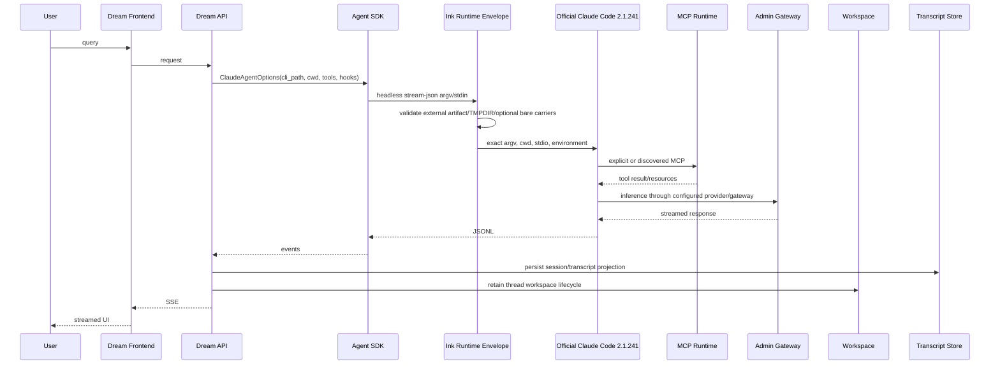
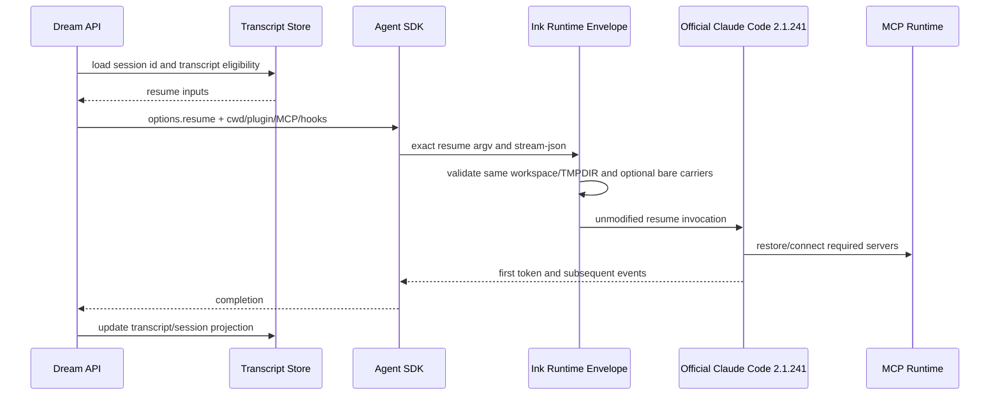

<!-- [Input] Official 2.1.241/SDK 0.2.143 evidence, Dream read-only evidence, legal terms, and clean-room contracts. -->
<!-- [Output] Define the evidence-led minimal Runtime decision, explicit bare profile, packaging, compatibility, and rollback. -->
<!-- [Pos] Canonical design for the independent Runtime envelope; it is not Claude Code source or a Claude Code product. -->

# Claude Code Runtime minimalization decision

Evidence date: 2026-08-23. This document describes an independent supervisor that runs a user-supplied official artifact; it does not contain, rebuild, patch, or rename Claude Code.

## 1. Background and problem

Dream needs Claude Agent SDK headless streaming, tools, workspace/sandbox, MCP, plugins/skills/hooks, transcript, and resume. The requested optimization was to reduce Runtime loading without changing Dream business code. Current Claude Code `2.1.241` is an opaque, native Bun single executable. Historical restored source is not a current or licensed build input, so a minimized core cannot be produced or claimed.

## 2. Current version matrix

| Component | Evidence baseline | Applicability |
| --- | --- | --- |
| Claude Code | `2.1.241`; platform packages are native executables | Required external artifact; unmodified and run as published |
| Agent SDK Python | upstream main `0.2.143`, bundled CLI `2.1.241` | Current interface baseline |
| Dream observed SDK | `0.2.140` | Compatibility test baseline until Dream upgrades |
| Bun | `1.2.20` | Lock/build orchestration only |
| Produced wrapper | Node `>=22,<25` ESM | Independent supervisor; no Claude protocol parsing |
| Restored source | historical Claude Code `2.1.88` | Read-only historical evidence; never copied or built |

Official package metadata and SDK source are primary version evidence. The current workstation executable `2.1.220` is not accepted as a `2.1.241` deployment artifact.

Current official `2.1.241` distribution-shape evidence:

| Evidence | Observed result | Applicability |
| --- | --- | --- |
| npm wrapper package | 7 files, 26,357-byte tarball, 175,849 bytes unpacked; `bin.claude=bin/claude.exe` | The small package is an installer/selector, not the Runtime core |
| platform selection | eight exact `2.1.241` optional packages for Darwin, Linux glibc/musl, and Windows | Deployment must pin the selected platform artifact, not only the wrapper |
| Darwin arm64 artifact | one 325,055,632-byte Mach-O `claude` plus package metadata | Native single-file core; no public module/tree-shaking boundary |
| Linux x64 glibc artifact | one 342,636,848-byte ELF `claude`; SHA-256 `0771bd866cff82b76581fc0499f6529e1a36845078f144f8c81dccb3bc7037b8` | Production-shape evidence for the Debian/glibc target |
| packaged source maps/resources | no `.map`, `.wasm`, `.node`, or separate dynamic JavaScript resources in either inspected platform package | Restored maps are not current-package build inputs |
| Darwin dynamic libraries | `libicucore`, `libresolv`, `libc++`, `libSystem` | Supplied by the host OS; never copied into this envelope |
| Linux dynamic libraries | `librt`, `libc`, dynamic loader, `libpthread`, `libdl`, `libm` | glibc host contract; vendor executable remains external |

These are package/file-format observations, not permission to reverse engineer,
modify, or redistribute the executable. Static/dynamic feature registration
inside the native core remains opaque; current behavior is proven only through
official flags, protocol observations, and black-box tests.

## 3. Claude Code and IM capability matrix

| 能力 | IM 是否使用 | 调用入口 | 加载时机 | 必需/可选 | 禁用影响 | 当前版本证据 |
| --- | --- | --- | --- | --- | --- | --- |
| Headless/SDK client | 已证实使用 | `ClaudeAgentRunner` → `SimpleClaudeAgentSDKClient` → `ClaudeSDKClient` | 每个 Agent turn 启动/连接 | 必需 | 无法运行 Dream/Chat | RUN, CLIENT；SDK `0.2.140` 合同夹具 |
| SDK one-shot `query()` | 已证实未使用 | Dream 生产链路无此入口 | 不加载 | 可选 | 无当前业务影响 | CLIENT 使用双向 client；源码搜索无生产调用 |
| streaming 输入/输出与 SSE | 已证实使用 | SDK stream-json → runner/parser → EventBus/SSE router | turn 全程 | 必需 | 首 Token、增量正文和终态丢失 | RUN, ROUTER；Dream SSE 回归 |
| session ID 与 transcript | 已证实使用 | SDK result/init → thread 持久化；本地 JSONL 探针 | init、turn 结束、后续启动 | 必需 | 无法建立会话连续性 | SVC, RUN, ENV；Dream session 回归 |
| resume | 条件使用 | persisted session ID + transcript contract → SDK `resume` | guidance/confirmation 或服务重启后的后续 turn | 必需于续聊 | 续聊退化或错误串线 | SVC, RUN；首次 turn 明确不 resume |
| tool use/result | 已证实使用 | SDK content/control frames → runner → persisted parts | 模型产生 tool use 时 | 必需 | 文件/MCP/业务工具链失效 | RUN, ROUTER；tool DTO 回归 |
| permission 与 tool confirmation | 已证实使用 | `PreToolUse`/`can_use_tool` → confirmation API | 受控工具调用时 | 必需 | 权限合同或交互确认被绕过/阻断 | RUN, ROUTER；批准/拒绝回归 |
| Workspace、cwd 与文件工具 | 条件使用 | thread factory/server-owned cwd → SDK options | Workspace Mode 或文件工具启用时 | 条件必需 | Workspace/Read/Grep 等失效 | TF, SVC, RUN |
| sandbox | 条件使用 | SDK sandbox options + settings | turn 启动时 | 条件必需 | 启用场景越权或无法执行 | RUN；生产 settings 内容仍需真实验收 |
| `CLAUDE_CODE_TMPDIR` | 已证实使用 | ENV 创建 `{thread}/.claude-tmp`；launcher 校验 | 每次 CLI 启动前 | 必需 | 违反 thread 隔离安全合同 | ENV；0700/no-symlink/exact-child 回归 |
| 内置/产品 MCP | 条件使用 | runner 组合 Editor、Story Workspace、Memory/Necklace 等 | options 构造/连接时 | 条件必需 | 对应编辑、故事、记忆能力失效 | RUN, SVC；Memory/Necklace 默认关闭 |
| 用户级 stdio MCP | 已证实使用 | user MCP config → `mcp_servers`/CLI config | Agent 连接时 | 必需于已配置用户 | 用户工具不可用 | RUN；MCP driver/service 回归 |
| 用户级 HTTP/SSE MCP | 条件使用 | remote MCP config → official Runtime | 远端 server 被配置/连接时 | 条件必需 | 远端工具不可用 | RUN；真实 HTTP/OAuth 仍待 E2E |
| MCP OAuth | 条件使用 | MCP resources API → official `mcp login/logout` | 用户发起授权/注销时 | 条件必需 | OAuth server 无法使用 | ROUTER/SVC；CLI argv 合同已验，真实授权待验 |
| MCP Resources | 条件使用 | Dream MCP Resources 页面与 server config API | 页面查询/Agent 复用时 | 条件必需 | Resources 页面和复用合同退化 | MCP router/service 回归；原始 SDK resources inventory 未报告 |
| MCP server/tool inventory | 已证实使用 | inventory service → Runtime/SDK init metadata | 配置校验与会话 init | 必需 | 无法展示/校验可用工具 | MCP inventory 回归；tools 已报告 |
| plugin-scope MCP | 条件使用 | locked plugin materialization → official plugin discovery | plugin 装载时 | 条件必需 | plugin 内 MCP 不可用 | SVC/RUN；真实 plugin MCP 待 E2E |
| plugins | 已证实使用 | Deck 锁定 plugin → `--plugin-dir` | Dream turn 启动时 | Dream 必需 | Dream Deck 合同失效 | SVC, RUN；plugin pipeline 回归 |
| skills | 条件使用 | plugin/explicit skill carriers | 发现或调用 skill 时 | 条件必需 | 已配置 skill 不可见 | SVC/RUN；语义 E2E 待验 |
| hooks | 已证实使用 | SDK Python hooks 与 Dream artifact turn hook | tool/turn lifecycle | 必需于 Dream artifact | artifact/策略钩子失效 | RUN；artifact hook 回归；file SessionStart/Stop 未注册 |
| slash commands | 暂无证据 | 无 Dream 生产调用入口证据 | 未确认 | 可选 | 未知；不得据此删除 core | 调用链与源码搜索 |
| subagents | 暂无证据 | 无 Dream 生产调用入口证据 | 未确认 | 可选 | 未知；不得据此删除 core | 调用链与源码搜索 |
| Remote Session | 暂无证据 | 无 Dream 生产调用入口证据 | 未确认 | 可选 | 未知；不得据此删除 core | 调用链与源码搜索 |
| swarm/team/teammate | 暂无证据 | 无 Dream 生产调用入口证据 | 未确认 | 可选 | 未知；不得据此删除 core | 调用链与源码搜索 |
| IDE integrations | 暂无证据 | 无 Dream 生产调用入口证据 | 未确认 | 可选 | 未知；不得据此删除 core | headless 生产链路证据 |
| telemetry | 暂无证据 | Dream 不直接调用；官方 core 内部行为不透明 | 未确认 | 不可擅改 | 修改可能破坏支持/合规 | `2.1.241` native artifact；无稳定 patch surface |
| updater | 已证实未使用 | 部署使用固定外部 artifact，无 update 调用 | 不加载于 Dream 入口 | 可选 | 无当前业务影响；仍不修改 core | Docker pin 与 CLI resolver |
| feedback/reporting | 暂无证据 | 无 Dream 生产调用入口证据 | 未确认 | 可选 | 未知；不得据此删除 core | 调用链与源码搜索 |
| diagnostics | 条件使用 | `--version`、doctor、MCP/auth 管理透传 | 部署检查或管理操作 | 运维必需 | 无法验证版本/定位启动问题 | envelope acceptance + real `2.1.241` doctor |
| authentication | 已证实使用 | 官方 CLI auth/env 与 Gateway 凭据透传 | Runtime 启动/请求时 | 必需 | 无法认证且可能违反法律门禁 | RUN；官方法律要求不得移除/限制 |
| gateway/provider 适配 | 已证实使用 | Dream options/env → Admin Gateway → provider | 每次推理请求 | 必需 | 无模型推理与结算 | RUN/SVC；本轮不改 Gateway |
| services registry | 暂无证据 | 无 Claude Code services-registry 直接调用证据 | 未确认 | 可选 | 未知；不得据此删除 core | Dream 只证实 Admin Gateway 资产 |
| workspace/plugin materialization | 条件使用 | SVC 在启动前同步 server-owned workspace 与 locked plugin | Workspace/Deck turn 前 | 条件必需 | 文件、plugin、resume 元数据不一致 | TF/SVC/RUN；materialization 回归 |

Evidence anchors: TF=`backend/claude_agent/thread_factory.py`; SVC=`backend/claude_agent/service.py`; RUN=`backend/libs/claude_agent_kit/server/agent_runner.py`; ENV=`backend/libs/claude_agent_kit/server/sdk_env.py`; CLIENT=`backend/libs/claude_agent_kit/server/simple_cas_client.py`; ROUTER=`backend/routers/claude_agent.py` in the read-only Dream repository. “暂无证据” never authorizes deletion: the official core remains whole and opaque.

## 4. Current start and resume call chains





## 5. Goals and non-goals

Goals: reproducible clean-room wrapper build; immutable manifest/checksum/SBOM/license receipts; unchanged CLI/SDK process boundary; explicit Runtime data ownership; safe rollback; bounded `--bare` evaluation.

Non-goals: modifying Dream, Python SDK, schemas, vendor binary/source, authentication behavior, Claude protocol/state machine, or claiming memory/startup improvement without measurement.

## 6. Runtime capability boundary

The wrapper may validate its own deployment contract, supervise a process group, enforce Dream's thread TMPDIR, and pass documented flags. It may not parse JSONL/MCP, modify the official executable, rewrite version output, intercept credentials, disable authentication methods, materialize user data, or brand itself as Claude Code.

## 7. Patch feasibility

No supported current source build, tree-shaking boundary, or stable patch surface was evidenced for the native `2.1.241` executable. Vendor/restored patching is rejected by version mismatch, maintainability, and redistribution gates. Tree shaking applies only to this small wrapper.

Documented current extension points are runtime inputs, not core build inputs:
Agent SDK `cli_path` and custom transport; CLI `--settings`, `--mcp-config`,
`--strict-mcp-config`, `--plugin-dir`, `--add-dir`, `--agents`, and `--bare`.
No official source-build entry, feature/build flag, module exclusion list, or
postinstall-patch contract was found. Because the current platform package is
a native executable without a source map or separate JS module graph, static
imports, dynamic imports, registration order, and import side effects cannot be
reliably classified or tree-shaken. Any internal modification could affect
stream-json, transcript/resume, MCP, tools, sandbox, authentication, or
Workspace, and would require modifying vendor implementation.

## 8. Candidate comparison

| Candidate | Evidence / official support | Maintainability / latest compatibility | IM and MCP impact | Upgrade risk / rollback | Decision |
| --- | --- | --- | --- | --- | --- |
| Official configuration minimalization | Supported documented settings/MCP/plugin/agent inputs; no core exclusion | High; valid on `2.1.241` | Reduces configured capabilities only, not core load; wrong config can remove required MCP/plugins | Low; remove config or restore prior file | Use for explicit configuration, not as a core-size claim |
| Official `--bare` | Supported flag; skips automatic hooks, skills, commands, subagents, plugins, MCP, memory, CLAUDE.md and OAuth/keychain reads | Medium; semantics may evolve with official releases | High unless every Dream carrier is explicit; OAuth and discovery are material risks | Medium; remove flag/profile together | Experimental opt-in only after full business A/B |
| Runtime lazy loading | Supported only inside this independent wrapper | High for wrapper; no effect on opaque core | Wrapper diagnostics stay off hot path; MCP/core unchanged | Low; direct official CLI path rollback | Implemented, but core reduction is 0 |
| Compile-time capability flags | No official build flag or current source build found | Not maintainable/applicable to native `2.1.241` | Unknown risk across SDK/MCP/tools/resume | Unbounded; no supported replay | Reject |
| Bundle tree shaking | No module graph/source map in platform package | Not applicable to native core; valid only for wrapper | Cannot prove unused registrations or side effects | Unbounded for core; rebuild wrapper to roll back | Reject for core |
| Postinstall binary/source patch | No official patch contract; legal terms require unmodified binary | Low; byte offsets/bundles change per release | High protocol/auth/MCP risk | High; reinstall exact official artifact | Reject / publication blocked |
| Replayable vendor patch set | Could store diffs without vendor source, but applying them still modifies restricted implementation | Low; every release needs conflict and semantic review | High; unchanged patch application does not prove behavior | High; discard patched artifact and restore official | Reject absent written authorization |
| Custom vendor-derived Runtime package | Requires copying/modifying official or restored implementation | Incompatible with current legal gate and restored `2.1.88` age | Would own all SDK/MCP/auth compatibility risk | Critical; replace package with official artifact | Blocked |
| Restored-source Bun rebuild | Historical `2.1.88`; no redistribution authorization; cannot prove parity with `2.1.241` | Low; recovered identifiers/modules are not an upstream build contract | Missing recent MCP/resume/security behavior is likely | Critical; abandon build and return to official | Blocked; restored source remains read-only |
| Clean-room external supervisor | Uses documented process/CLI path boundary; external core unmodified | High; exact manifest/version tests per release | Opaque forwarding preserves official semantics; adds TMPDIR/process supervision | Low; set `CLAUDE_CODE_CLI_PATH` directly to official | Implemented as an operations option, not an optimization claim |
| Direct official Runtime / loading-order hygiene | Fully supported published artifact | Highest; exact version pin | Preserves every observed and unknown capability | Lowest; select previous verified official artifact | Production and performance baseline |
| SDK/Dream protocol fork | Technically possible but not an official Runtime extension point | Low; duplicates state machine and parser | Highest divergence risk | High; revert application code | Rejected by scope and architecture |

## 9. Recommended solution

Keep direct official `2.1.241` as the performance and rollback baseline. Use this envelope only where manifest/TMPDIR/process supervision/receipts justify its overhead. Do not enable bare mode in production until the explicit carriers and full Dream business matrix pass against `2.1.241`/SDK `0.2.143`.

## 10. MCP compatibility strategy

The wrapper never implements MCP. It preserves CLI/config/stdin/stdout and leaves stdio/HTTP/SSE/OAuth/Resources/tool inventory to the official core and Agent SDK.

The authoritative recent evidence is the official main [`CHANGELOG.md`](https://github.com/anthropics/claude-code/blob/main/CHANGELOG.md), not release-body text alone:

- `2.1.240`: fixes clipped MCP elicitation forms and recovery of remote MCP servers after transient 5xx during mid-session reconnect, cloud, or SDK `setMcpServers()`.
- `2.1.238`: initializes stdio MCP before server discovery; changes `headersHelper` trust/credential handling; fixes disabled `mcp list/get` behavior.

Release notes and changelog may differ in detail, so compatibility claims cite the changelog and must be tested. Python MCP `1.27.0`/`1.27.1` remain provider-free regression targets; they are not substitutes for real CLI OAuth/remote reconnect tests.

## 11. Runtime artifact layout

```text
ink-claude-runtime-0.1.0/
  bin/ink-claude-runtime.mjs
  lib/*.mjs
  release-manifest.json
  manifest/
    artifact-manifest.json
    entrypoint-policy.json
    runtime-data-contract.json
    bare-profile.json
    dependency-licenses.json
    capabilities.json
    platforms.json
    build.json
    discovery.json
    rollback.json
    sbom.cdx.json
    checksums.sha256
```

The external official binary and all mutable/user material are absent.

## 12. Runtime data lifecycle

`runtime/runtime-data-contract.json` is authoritative. Dream owns workspace and `.claude-tmp`; the latter must be the exact real workspace child with mode 0700 or stricter. Claude Code/Dream retain transcripts for resume. Users/operators own MCP/plugin/settings/auth material. The wrapper neither reads credentials nor cleans those stores.

## 13. SDK and Runtime interface contract

The only SDK interface is upstream `ClaudeAgentOptions.cli_path`, selected through `CLAUDE_CODE_CLI_PATH`. Upstream baseline is SDK `0.2.143` with bundled CLI `2.1.241`; current Dream `0.2.140` remains a compatibility observation. No SDK schema or transport modification is introduced.

Bare activation is caller-supplied `--bare` plus `INK_CLAUDE_BARE_PROFILE=dream-explicit-v1`. The wrapper never injects `--bare`. It requires `-p`, absolute settings/MCP/plugin carriers, strict MCP, exact cwd/workspace, TMPDIR, and session persistence. This checks carriers, not their semantic completeness; E2E remains the final gate.

## 14. Build and release flow

```mermaid
sequenceDiagram
    participant U as Upstream SDK 0.2.143
    participant R as Clean-room Runtime Source
    participant B as Bun 1.2.20
    participant P as Python Builder
    participant T as Test Suite
    participant M as Manifest/SBOM/Checksums
    participant G as Git Remote
    U-->>R: read-only cli_path/version evidence
    R->>B: frozen lock build
    P-->>T: external SDK compatibility evidence only
    B->>T: Node bundle and fixtures
    T->>M: verified immutable release
    M-->>G: only clean-room source/contracts; no vendor artifact
```

Commands are `bun install --frozen-lockfile`, `bun run lint`, `bun run build`, `bun run test`, `bun run package`, and `bun run verify`. Python SDK packaging stays in its own repository/wheel flow.

## 15. Security and license boundary

Official legal guidance requires the binary remain unmodified and run as published; customers may not remove, disable, or restrict built-in authentication unless separately agreed. The wrapper therefore passes auth commands and auth environment unchanged, never selects a method, and does not inject bare mode. It is named and described as an independent envelope, not Claude Code.

The official package/restored package license is all-rights-reserved and points to Anthropic legal agreements. The target GitHub repository was verified `PRIVATE`, but repository visibility does not grant redistribution rights. No redistribution permission was established. Vendor source, binary, bundle, map, logo, tokens, transcripts, settings, or workspace content must never enter git or the release.

## 16. Upgrade and replay

For each upstream release: update exact package/platform metadata; inspect official `CHANGELOG.md`; update SDK/CLI pairing; rebuild from frozen lock; run manifest/legal lint, provider-free tests, official CLI differential tests, and real Dream/MCP validation. There is no vendor patch to replay; any appearance of one is a release blocker.

## 17. Rollback

Rollback is configuration-only: restore `CLAUDE_CODE_CLI_PATH` to the previously verified official executable. Do not mutate immutable release directories or the external binary. Bare mode rolls back by removing the caller flag/profile together and returning to official default discovery.

## 18. Test matrix

| Test | Local status/claim |
| --- | --- |
| JSONL/argv/env/cwd exact forwarding | provider-free fixture |
| version/help/MCP/auth command forwarding | provider-free fixture |
| auth environment preservation without value logging | provider-free presence assertions |
| external path/version doctor | provider-free fixture plus bounded real official `2.1.241` version/doctor probe; deployment pending |
| TMPDIR/symlink/mode/workspace | provider-free fixture |
| bare explicit carriers/no injection/fail closed | provider-free fixture |
| cancel/timeout/crash/process group | provider-free fixture |
| checksums/SBOM/license/legal/contracts | release verifier |
| SDK `0.2.140` Dream path | current local compatibility harness |
| installed SDK `0.2.143` → actual envelope → external core | passed: real official `2.1.241` bounded version probe plus public `query()` through a no-network core fixture |
| real OAuth/MCP reconnect/Dream E2E | pending user-specified actor/entities and validation budget |

## 19. Acceptance criteria and design self-review

Accept the clean-room package when lint, build, unit tests, release verify, package, and reproducibility pass; release contains no vendor/user material; exact manifests reference `2.1.241`/`0.2.143`; auth is untouched; and rollback is documented. Do not claim Runtime reduction or IM completeness until real business E2E passes.

| Self-review question | Answer |
| --- | --- |
| Focused on Runtime rather than Dream business changes? | Yes; Dream remains read-only. |
| Evidence supports deleting an official capability? | No deletion is attempted; the core stays whole. |
| SDK, MCP, tools, SSE, workspace, sandbox, and resume retained? | Yes at the opaque boundary; real E2E remains explicitly pending. |
| Depends on historical restored behavior? | No; restored `2.1.88` is reference-only. |
| Introduces a second agent state machine or Python SDK rewrite? | No. |
| Packages transcript, workspace, plugin, MCP, OAuth, auth, or settings data? | No; verifier rejects these classes. |
| Meets redistribution/authentication constraints? | Yes for the clean-room wrapper: external unmodified artifact, no auth selection/removal; vendor redistribution remains blocked. |
| Upgrade replay and rollback independent? | Yes; manifests/tests update per version and rollback is `CLAUDE_CODE_CLI_PATH` configuration. |
| Is `--bare` minimal and proven? | Carrier validation is minimal; it is not production-enabled or claimed semantically complete. |

## 20. Open items and blockers

- Redistribution of official/restored implementation is blocked without separate authorization.
- Dream currently pins SDK `0.2.140`; upstream-baseline `0.2.143` business validation belongs to the parent integration task.
- Bare profile settings/plugin/MCP content is not yet semantically attested; real new session, resume, SSE, tools, sandbox, auth, OAuth, Resources, and reconnect remain pending.
- The local official executable is `2.1.220`, so it cannot satisfy the `2.1.241` doctor gate.
- No commit, push, merge, package publication, or deployment is authorized in this task.
