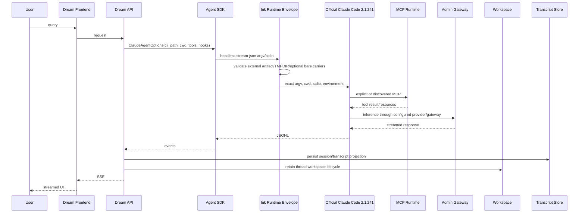
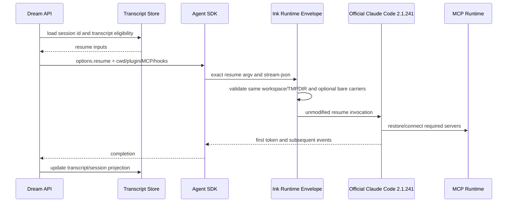

<!-- [Input] Official 2.1.241/SDK 0.2.143 evidence, Dream read-only evidence, legal terms, and clean-room contracts. -->
<!-- [Output] Define the evidence-led minimal Runtime decision, explicit bare profile, packaging, compatibility, and rollback. -->
<!-- [Pos] Canonical design for the independent Runtime envelope; it is not Claude Code source or a Claude Code product. -->

# Claude Code Runtime minimalization decision

Evidence date: 2026-08-23. This document describes an independent supervisor that runs a user-supplied official artifact; it does not contain, rebuild, patch, or rename Claude Code.

## 1. Background and problem

Dream needs Claude Agent SDK headless streaming, tools, workspace/sandbox, MCP, plugins/skills/hooks, transcript, and resume. The requested optimization was to reduce Runtime loading without changing Dream business code. Current Claude Code `2.1.241` is an opaque, native Bun single executable. Historical restored source is not a current or licensed build input, so a minimized core cannot be produced or claimed.

## 2. Current version matrix

| Component | Evidence baseline | Applicability |
| --- | --- | --- |
| Claude Code | `2.1.241`; platform packages are native executables | Required external artifact; unmodified and run as published |
| Agent SDK Python | upstream main `0.2.143`, bundled CLI `2.1.241` | Current interface baseline |
| Dream observed SDK | `0.2.140` | Compatibility test baseline until Dream upgrades |
| Bun | `1.2.20` | Lock/build orchestration only |
| Produced wrapper | Node `>=22,<25` ESM | Independent supervisor; no Claude protocol parsing |
| Restored source | historical Claude Code `2.1.88` | Read-only historical evidence; never copied or built |

Official package metadata and SDK source are primary version evidence. The current workstation executable `2.1.220` is not accepted as a `2.1.241` deployment artifact.

## 3. Claude Code and IM capability matrix

| Capability | Dream status | Default envelope | Explicit `--bare` carrier | Bare decision |
| --- | --- | --- | --- | --- |
| SDK/headless JSONL and SSE projection | 已证实使用 | opaque stdio/argv | `-p`, stream-json flags | required |
| tool use/result and permission callbacks | 已证实使用 | stdin remains open | settings/SDK control frames | required, semantic E2E pending |
| workspace/cwd and file tools | 已证实使用 | cwd unchanged | cwd equals declared workspace | fail closed |
| sandbox | 已证实使用 | official discovery/settings | absolute `--settings` file | content/E2E pending |
| `CLAUDE_CODE_TMPDIR` | 已证实使用 | exact `.claude-tmp`, 0700, no symlink | same contract | enforced |
| session/transcript/resume | 已证实使用 | argv/config opaque | persistence required; resume/session flags opaque | `--no-session-persistence` rejected |
| stdio/HTTP/SSE MCP, Resources, OAuth | 已证实使用 | official core/config | strict absolute `--mcp-config` | real OAuth/E2E pending |
| plugins/skills/hooks | 已证实使用或条件使用 | official discovery | absolute `--plugin-dir` plus settings | carrier checked; contents pending |
| built-in authentication | required legal/product capability | all methods/env/commands preserved | caller chooses official bare-compatible method | wrapper never selects or converts |
| Remote Session/team/swarm/IDE | 暂无 Dream 使用证据 | not removed from official core | not claimed | no core deletion |

## 4. Current start and resume call chains





## 5. Goals and non-goals

Goals: reproducible clean-room wrapper build; immutable manifest/checksum/SBOM/license receipts; unchanged CLI/SDK process boundary; explicit Runtime data ownership; safe rollback; bounded `--bare` evaluation.

Non-goals: modifying Dream, Python SDK, schemas, vendor binary/source, authentication behavior, Claude protocol/state machine, or claiming memory/startup improvement without measurement.

## 6. Runtime capability boundary

The wrapper may validate its own deployment contract, supervise a process group, enforce Dream's thread TMPDIR, and pass documented flags. It may not parse JSONL/MCP, modify the official executable, rewrite version output, intercept credentials, disable authentication methods, materialize user data, or brand itself as Claude Code.

## 7. Patch feasibility

No supported current source build, tree-shaking boundary, or stable patch surface was evidenced for the native `2.1.241` executable. Vendor/restored patching is rejected by version mismatch, maintainability, and redistribution gates. Tree shaking applies only to this small wrapper.

## 8. Candidate comparison

| Candidate | Core reduction | Legal/compatibility | Decision |
| --- | ---: | --- | --- |
| Direct official `2.1.241` | 0 | lowest risk | production baseline |
| Official `--bare` with explicit inputs | possible discovery reduction; unmeasured | official flag, but skips required discovery and OAuth/keychain | experimental opt-in only |
| Independent supervisor | 0 | legal if child is external/unmodified and auth untouched | implemented operations option |
| Binary/source patch or restored rebuild | unknown | prohibited/unsupported without separate authorization | blocked |
| SDK/Dream protocol fork | 0 | duplicates state machine and violates scope | rejected |

## 9. Recommended solution

Keep direct official `2.1.241` as the performance and rollback baseline. Use this envelope only where manifest/TMPDIR/process supervision/receipts justify its overhead. Do not enable bare mode in production until the explicit carriers and full Dream business matrix pass against `2.1.241`/SDK `0.2.143`.

## 10. MCP compatibility strategy

The wrapper never implements MCP. It preserves CLI/config/stdin/stdout and leaves stdio/HTTP/SSE/OAuth/Resources/tool inventory to the official core and Agent SDK.

The authoritative recent evidence is the official main [`CHANGELOG.md`](https://github.com/anthropics/claude-code/blob/main/CHANGELOG.md), not release-body text alone:

- `2.1.240`: fixes clipped MCP elicitation forms and recovery of remote MCP servers after transient 5xx during mid-session reconnect, cloud, or SDK `setMcpServers()`.
- `2.1.238`: initializes stdio MCP before server discovery; changes `headersHelper` trust/credential handling; fixes disabled `mcp list/get` behavior.

Release notes and changelog may differ in detail, so compatibility claims cite the changelog and must be tested. Python MCP `1.27.0`/`1.27.1` remain provider-free regression targets; they are not substitutes for real CLI OAuth/remote reconnect tests.

## 11. Runtime artifact layout

```text
ink-claude-runtime-0.1.0/
  bin/ink-claude-runtime.mjs
  lib/*.mjs
  release-manifest.json
  manifest/
    artifact-manifest.json
    entrypoint-policy.json
    runtime-data-contract.json
    bare-profile.json
    dependency-licenses.json
    capabilities.json
    platforms.json
    build.json
    discovery.json
    rollback.json
    sbom.cdx.json
    checksums.sha256
```

The external official binary and all mutable/user material are absent.

## 12. Runtime data lifecycle

`runtime/runtime-data-contract.json` is authoritative. Dream owns workspace and `.claude-tmp`; the latter must be the exact real workspace child with mode 0700 or stricter. Claude Code/Dream retain transcripts for resume. Users/operators own MCP/plugin/settings/auth material. The wrapper neither reads credentials nor cleans those stores.

## 13. SDK and Runtime interface contract

The only SDK interface is upstream `ClaudeAgentOptions.cli_path`, selected through `CLAUDE_CODE_CLI_PATH`. Upstream baseline is SDK `0.2.143` with bundled CLI `2.1.241`; current Dream `0.2.140` remains a compatibility observation. No SDK schema or transport modification is introduced.

Bare activation is caller-supplied `--bare` plus `INK_CLAUDE_BARE_PROFILE=dream-explicit-v1`. The wrapper never injects `--bare`. It requires `-p`, absolute settings/MCP/plugin carriers, strict MCP, exact cwd/workspace, TMPDIR, and session persistence. This checks carriers, not their semantic completeness; E2E remains the final gate.

## 14. Build and release flow

```mermaid
sequenceDiagram
    participant U as Upstream SDK 0.2.143
    participant R as Clean-room Runtime Source
    participant B as Bun 1.2.20
    participant P as Python Builder
    participant T as Test Suite
    participant M as Manifest/SBOM/Checksums
    participant G as Git Remote
    U-->>R: read-only cli_path/version evidence
    R->>B: frozen lock build
    P-->>T: external SDK compatibility evidence only
    B->>T: Node bundle and fixtures
    T->>M: verified immutable release
    M-->>G: only clean-room source/contracts; no vendor artifact
```

Commands are `bun install --frozen-lockfile`, `bun run lint`, `bun run build`, `bun run test`, `bun run package`, and `bun run verify`. Python SDK packaging stays in its own repository/wheel flow.

## 15. Security and license boundary

Official legal guidance requires the binary remain unmodified and run as published; customers may not remove, disable, or restrict built-in authentication unless separately agreed. The wrapper therefore passes auth commands and auth environment unchanged, never selects a method, and does not inject bare mode. It is named and described as an independent envelope, not Claude Code.

The official package/restored package license is all-rights-reserved and points to Anthropic legal agreements. The target GitHub repository was verified `PRIVATE`, but repository visibility does not grant redistribution rights. No redistribution permission was established. Vendor source, binary, bundle, map, logo, tokens, transcripts, settings, or workspace content must never enter git or the release.

## 16. Upgrade and replay

For each upstream release: update exact package/platform metadata; inspect official `CHANGELOG.md`; update SDK/CLI pairing; rebuild from frozen lock; run manifest/legal lint, provider-free tests, official CLI differential tests, and real Dream/MCP validation. There is no vendor patch to replay; any appearance of one is a release blocker.

## 17. Rollback

Rollback is configuration-only: restore `CLAUDE_CODE_CLI_PATH` to the previously verified official executable. Do not mutate immutable release directories or the external binary. Bare mode rolls back by removing the caller flag/profile together and returning to official default discovery.

## 18. Test matrix

| Test | Local status/claim |
| --- | --- |
| JSONL/argv/env/cwd exact forwarding | provider-free fixture |
| version/help/MCP/auth command forwarding | provider-free fixture |
| auth environment preservation without value logging | provider-free presence assertions |
| external path/version doctor | provider-free fixture plus bounded real official `2.1.241` version/doctor probe; deployment pending |
| TMPDIR/symlink/mode/workspace | provider-free fixture |
| bare explicit carriers/no injection/fail closed | provider-free fixture |
| cancel/timeout/crash/process group | provider-free fixture |
| checksums/SBOM/license/legal/contracts | release verifier |
| SDK `0.2.140` Dream path | current local compatibility harness |
| SDK `0.2.143`, real OAuth/MCP reconnect/Dream E2E | pending parent validation |

## 19. Acceptance criteria and design self-review

Accept the clean-room package when lint, build, unit tests, release verify, package, and reproducibility pass; release contains no vendor/user material; exact manifests reference `2.1.241`/`0.2.143`; auth is untouched; and rollback is documented. Do not claim Runtime reduction or IM completeness until real business E2E passes.

| Self-review question | Answer |
| --- | --- |
| Focused on Runtime rather than Dream business changes? | Yes; Dream remains read-only. |
| Evidence supports deleting an official capability? | No deletion is attempted; the core stays whole. |
| SDK, MCP, tools, SSE, workspace, sandbox, and resume retained? | Yes at the opaque boundary; real E2E remains explicitly pending. |
| Depends on historical restored behavior? | No; restored `2.1.88` is reference-only. |
| Introduces a second agent state machine or Python SDK rewrite? | No. |
| Packages transcript, workspace, plugin, MCP, OAuth, auth, or settings data? | No; verifier rejects these classes. |
| Meets redistribution/authentication constraints? | Yes for the clean-room wrapper: external unmodified artifact, no auth selection/removal; vendor redistribution remains blocked. |
| Upgrade replay and rollback independent? | Yes; manifests/tests update per version and rollback is `CLAUDE_CODE_CLI_PATH` configuration. |
| Is `--bare` minimal and proven? | Carrier validation is minimal; it is not production-enabled or claimed semantically complete. |

## 20. Open items and blockers

- Redistribution of official/restored implementation is blocked without separate authorization.
- Dream currently pins SDK `0.2.140`; upstream-baseline `0.2.143` business validation belongs to the parent integration task.
- Bare profile settings/plugin/MCP content is not yet semantically attested; real new session, resume, SSE, tools, sandbox, auth, OAuth, Resources, and reconnect remain pending.
- The local official executable is `2.1.220`, so it cannot satisfy the `2.1.241` doctor gate.
- No commit, push, merge, package publication, or deployment is authorized in this task.
