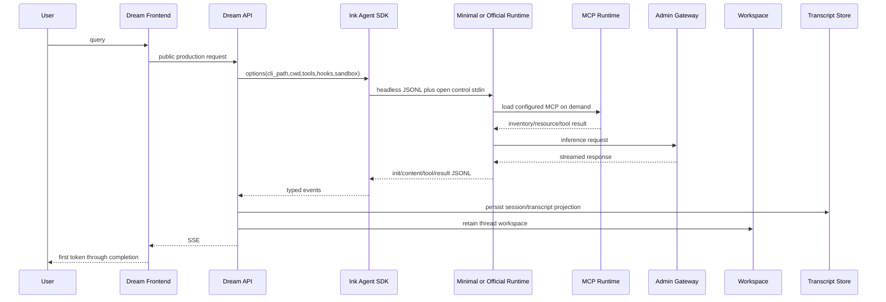
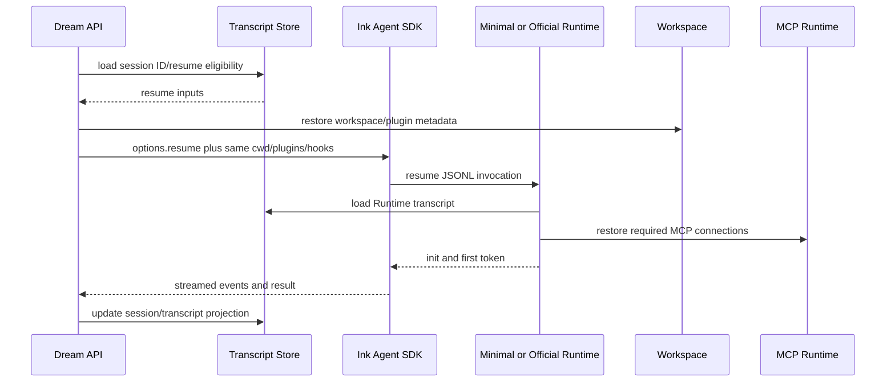
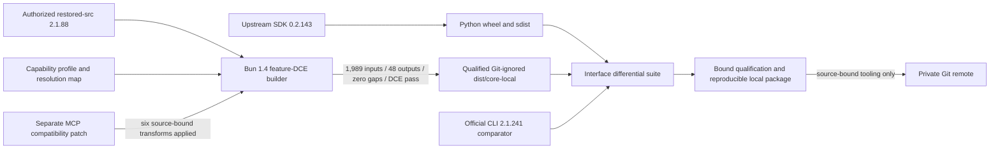

<!-- [Input] Dream call-chain evidence, Claude Code 2.1.88 restored source, Bun 1.4 feature-DCE evidence, current SDK/CLI contracts, and MCP 2.1.238/2.1.239 deltas. -->
<!-- [Output] Define the local minimal Runtime architecture, capability boundary, build/publish gate, compatibility layers, and three-level acceptance contract. -->
<!-- [Pos] Canonical 20-section design for the locally built ink-claude-code-dream Runtime. -->
<!-- [Sync] 2026-08-24: record the qualified zero-gap core, applied MCP compatibility, local package policy, and separate business/publication decisions. -->

# Claude Code Runtime minimalization

Evidence date: 2026-08-24.

Decision status: **technical implementation and qualification complete for the current local artifact**. The user-authorized Claude Code `2.1.88` restored tree is an explicit local reference and build input. Bun `1.4.0` compile-time features remove IM-irrelevant branches into Git-ignored `dist/core-local/`. The repository stores only repository-authored source-bound transformation code, capability profiles, resolution metadata, tests, and documentation; it does not store the restored tree or the derived core artifact. These are technical provenance claims, not a finding of redistribution permission.

The exact artifact has source digest `470ca57d6390e2f9df5e2bb0a6f32b8b62c64f262ae3d02a31349488a08c228e` and bundle SHA-256 `6904d3cd7954ead347cc5f5dd65f1313cfa78e0a080514e9efc874e51ff88893`. Its sanitized graph contains 1,989 inputs and 48 outputs with zero resolution gaps; feature-DCE and required-input assertions pass. SDK, MCP protocol, MCP management, and aggregate qualification receipts bind those same hashes. The build and release manifests keep `sourceVersionEvidence=2.1.88` distinct from the qualified Dream-facing `cliCompatibilityVersion=2.1.241`. The reproducible 62-file package has tree SHA-256 `90e205c41a4fcda5c4ba72a2cd84b6f82e8a7fd1b0b7055b50ea4ef7cd7f5a78` and records `productionEligible=true`, `publicationAllowed=false`, and `redistributionAllowed=false`.

## 1. Background and problem definition

Dream currently reaches Claude through the Python Agent SDK and a CLI path/process boundary. It needs headless JSON/JSONL streaming, control messages, tools, permissions, Workspace, sandbox, transcript/resume, plugins/skills/hooks, authentication/gateway behavior, and MCP. It does not need the full interactive Claude Code product surface.

The task is to produce a separately named SDK distribution and a locally packaged minimal Runtime without copying the Agent protocol or adding a Dream-only state machine. Core pruning must be decided from Dream's real call graph and then verified at the Runtime interface. A successful UI journey is necessary but cannot prove Runtime protocol completeness by itself.

## 2. Current version matrix

| Component | Baseline | Applicability |
| --- | --- | --- |
| Official rollback CLI | Claude Code `2.1.241` | Current black-box behavior and rollback target |
| Restored Runtime source | Claude Code `2.1.88`; sourcemap repository commit `a8a678cb6244e6770e1e421767ff0987a1d95549` | Explicitly authorized external local reference/build input; historical implementation, not evidence of `2.1.241` parity |
| Restored source digest | SHA-256 `470ca57d6390e2f9df5e2bb0a6f32b8b62c64f262ae3d02a31349488a08c228e`; 4,471 files; 46,447,794 bytes | Builder receipt must bind the exact input without copying it into Git |
| Agent SDK mirror | `ink-claude-dream-agent-sdk==0.2.143`, public namespace `claude_agent_sdk` unchanged | Dream's self-packaged SDK baseline; uses upstream CLI-path injection |
| SDK bundled CLI baseline | `2.1.241` | Current SDK/official CLI compatibility comparator |
| Core builder | Bun `1.4.0` | Required for `bun:bundle` compile-time `feature()` DCE |
| Existing envelope build | Bun `1.2.20`, Node-target wrapper | Historical process-boundary baseline; not the pruned core |
| Core entrypoint | `${INK_AUTHORIZED_CORE_SOURCE_ROOT}/src/entrypoints/cli.tsx` → external `src/main.tsx` → external `src/cli/print.ts` | Recovered headless build graph; these are not this repository's `src/` files |
| Core output | `dist/core-local/` and `dist/core-package-local/` | Local, generated, Git-ignored, technically qualified, and not publishable or redistributable |

Official `2.1.241` package metadata and behavior remain primary evidence for current external compatibility. Restored `2.1.88` code is primary evidence only for its own source graph. Recent MCP behaviors are maintained as separate, source-hash-bound compatibility patches rather than being assumed present in the old source.

## 3. Claude Code and IM capability matrix

| 能力 | IM 是否使用 | 调用入口 | 加载时机 | 必需/可选 | 禁用影响 | 当前版本证据 |
| --- | --- | --- | --- | --- | --- | --- |
| Headless/SDK client | 已证实使用 | `ClaudeAgentRunner` → `ClaudeSDKClient` → CLI path | 每个 turn | 必需 | Dream/Chat 无法运行 | Dream RUN/CLIENT；SDK transport contract |
| streaming JSON/JSONL 与 SSE | 已证实使用 | CLI stream-json → SDK → Dream EventBus/SSE | turn 全程 | 必需 | 首 Token、增量内容、终态丢失 | `print.ts`/`structuredIO.ts`/`query.ts`；Dream SSE tests |
| 双向 control/cancel | 已证实使用 | SDK stdin control → permission/cancel | 工具确认与取消时 | 必需 | 无法确认或取消 | `structuredIO.ts`；Dream runner/router |
| session、transcript、resume | 已证实使用 | SDK session ID + Runtime transcript → later `--resume` | init、结束、续聊 | 必需 | 会话连续性失效 | `sessionStorage.ts`/`sessionRestore.ts`; Dream service |
| tool use/result | 已证实使用 | Runtime tool frames → SDK → persisted parts | 模型调用工具时 | 必需 | 文件/MCP/业务工具失效 | `tools.ts`; Dream parser/router |
| permission/tool confirmation | 已证实使用 | permission rules + SDK callback | 受控工具调用时 | 必需 | 越权或错误阻断 | `permissions.ts`; Dream confirmation API |
| Workspace/cwd/文件工具 | 条件使用 | thread workspace → `cwd`/filesystem tools | Workspace Mode/文件工具启用 | 条件必需 | 文件上下文失效 | `cwd.ts`/filesystem permissions; Dream thread factory |
| sandbox | 条件使用 | SDK settings + Runtime sandbox adapter | turn 启动 | 条件必需 | 隔离合同退化 | `sandbox-adapter.ts`; Dream options |
| `CLAUDE_CODE_TMPDIR` | 已证实使用 | `{thread}/.claude-tmp` | CLI 启动前 | 必需 | 违反 thread 边界 | Dream `sdk_env.py`; filesystem roots retained |
| MCP stdio/HTTP/OAuth/Resources | 已证实使用或条件使用 | Dream MCP config/resources API → SDK/Runtime | init、连接、授权、工具调用 | 必需于已配置能力 | MCP 页面/工具失效 | restored MCP client/auth/resource tools; Dream MCP suites |
| MCP inventory 与 tool result | 已证实使用 | Runtime init metadata + tool frames | discovery/tool call | 必需 | 无法展示/执行 MCP tool | MCP service/inventory tests |
| plugins | 已证实使用 | locked Deck plugin → `--plugin-dir` | turn 启动 | 必需 | Deck 能力失效 | Dream service/runner; plugin loader retained |
| Slash Skill / filesystem/plugin skills | 已证实使用或条件使用 | slash Skill 与 plugin skill discovery | discovery/invocation | 必需于 Dream extension contract | skill 调用失效 | `loadSkillsDir.ts`; Dream plugin/skill carriers |
| hooks | 已证实使用 | SDK hooks + Dream artifact hook | tool/turn lifecycle | 必需 | artifact/policy lifecycle 失效 | Runtime hooks + Dream runner |
| ordinary Agent/Task subagents | 条件使用，必须保留 | Agent/Task tools | 模型委派时 | 条件必需 | Agent 工作流失效 | Dream allowed tools; restored Agent/Task paths |
| Remote Control / CCR bridge | 已证实未使用 | Dream 无入口 | 不应加载 | 可删 | 无 IM 影响 | Dream call graph；CCR/bridge feature graph |
| swarm/team/teammate UI | 已证实未使用 | Dream 无 team UI/control plane | 不应加载 | 可删 | 无 IM 影响 | Dream call graph；TEAMMEM/coordinator/buddy features |
| interactive Ink REPL | 已证实未使用 | Dream 只走 `-p` headless | 不应加载 | 可删 | 无 IM 影响 | Dream CLI argv；headless `print.ts` |
| IDE auto-connect/UI surface | 已证实未使用 | Dream 无 IDE bridge | 不应加载 | 可删 | 无 IM 影响 | headless production graph |
| updater command/UI | 已证实未使用 | immutable package/CLI path | 不应加载 | 可删 command/UI | 无 IM 影响 | deployment pin；interactive command graph |
| feedback/reporting command/UI | 已证实未使用 | Dream 无入口 | 不应加载 | 可删 | 无 IM 影响 | Dream call graph；feedback command/UI graph |
| telemetry/shared diagnostics | 暂无足够图证据 | shared initialization/side effects possible | 未确认 | 暂缓 | 可能破坏 gates/support | 必须等 metafile/import-side-effect evidence |
| shared `autoUpdater.ts` logic | 暂无足够图证据 | 可能包含最低版本/共享检查 | 未确认 | 暂缓 | 可能破坏版本合同 | 仅删除 updater command/UI，不按文件名推断共享逻辑 |
| authentication/gateway | 已证实使用 | Runtime auth/API client → configured gateway/provider | 每次推理 | 必需 | 无法推理 | `auth.ts`/API client; Dream gateway config |
| workspace/plugin materialization | 条件使用 | Dream 启动前 materialize，Runtime discovery | turn/resume | 条件必需 | workspace/plugin 恢复不一致 | Dream service/thread factory |

Dream evidence anchors: `backend/claude_agent/thread_factory.py`, `backend/claude_agent/service.py`, `backend/libs/claude_agent_kit/server/agent_runner.py`, `sdk_env.py`, `simple_cas_client.py`, and `backend/routers/claude_agent.py` in the read-only Dream repository. “暂无足够图证据” means **retain**, not delete.

## 4. Current launch and resume call chains





## 5. Goals and non-goals

Goals: prune IM-irrelevant core branches; keep the full Dream interface contract; use the renamed upstream-compatible SDK; produce a deterministic local Bun build and evidence manifest; keep MCP upgrades separate and auditable; permit direct official CLI rollback.

Non-goals: Dream business changes, Schema/migration work, a second Agent/MCP state machine, transcript/workspace packaging, remote deployment, or representing the old source as current `2.1.241` implementation.

## 6. Runtime capability boundary

The minimal Runtime owns the existing CLI/JSONL/process contract. It may remove source modules only after the Dream matrix and Bun metafile prove they are unreachable or explicitly disabled. It must retain the profile's asserted inputs for streaming, bidirectional control, transcript/resume, permissions, workspace, sandbox, TMPDIR, MCP, extensions, and authentication/gateway.

The Python SDK remains an upstream-compatible distribution. It selects either the official CLI or the custom Runtime through the upstream `cli_path`/transport/process launcher injection point. It does not copy Runtime state, parse a second wire protocol, or own user data.

## 7. Patch and build feasibility

The current official `2.1.241` binary has no public core source/build graph suitable for source-level pruning. The restored `2.1.88` tree does expose `bun:bundle feature()` gates and a reconstructable entrypoint. Therefore the selected local implementation is a deterministic source build, not a binary patch:

- Bun is pinned to exactly `1.4.0` because earlier local Bun did not implement the required feature API.
- `runtime/core-prune-profile.json` declares all 89 observed features, required capabilities, source input assertions, defines, and DCE exclusions.
- `runtime/core-resolution-map.json` maps recovered package entries and permits only source-digest-bound narrow facades.
- `scripts/build-core-prune.ts` reads an explicit absolute, normalized, non-symlink source root; writes only ignored `dist/core-local`; records digest, metafile, gaps, and DCE results.
- `scripts/verify-core-prune.mjs` refuses any artifact unless build status is successful, gaps are zero, forbidden inputs are absent, and every required capability input survives.

Current result: build and verifier pass with 1,989 inputs, 48 outputs, zero gaps, passing DCE assertions, and every required MCP transform applied. The executable core is locally packaged and digest-qualified. This establishes the repository's technical `productionEligible=true` state, not permission to publish, redistribute, deploy, or claim a real-business run.

## 8. Candidate comparison

| Candidate | Support/evidence | IM/MCP impact | Upgrade/rollback | Decision |
| --- | --- | --- | --- | --- |
| Official configuration only | documented runtime inputs | reduces discovery, not bundle code | easy rollback | useful baseline, not core pruning |
| Runtime lazy initialization | source graph required | safe when shared side effects are proven | source-bound replay | use after core build closes |
| Compile-time feature DCE | restored `feature()` graph + Bun 1.4 | explicit KEEP assertions and REMOVE gates | replay profile; official CLI rollback | selected |
| Generic tree shaking | incomplete recovered dependency graph | may drop side effects | high ambiguity | insufficient alone |
| postinstall/binary patch | no stable binary contract | high protocol/auth risk | reinstall official | reject |
| replayable source patch | source hashes and semantic tests possible | appropriate for isolated compatibility deltas | conflict detection + official rollback | use only for clean, bounded deltas |
| restored-source Bun build | explicit local authorization and real source graph | owns old-to-current compatibility gap | local artifact deletion + official CLI | selected and technically qualified |
| external official Runtime | current behavior, opaque internals | preserves all capabilities | direct CLI path | comparator and rollback |

## 9. Recommended solution

The implementation completed two strictly ordered layers:

1. The `2.1.88` source resolver produced a zero-gap minimal core using the reviewed feature profile, with KEEP and REMOVE assertions proven in the Bun metafile.
2. The MCP `2.1.238`/`2.1.239` compatibility layer was applied independently, bound to exact old-source hashes, and the digest-bound interface and management suites passed.

The custom core now has its own real Dream/Gateway/PostgreSQL main-journey evidence. Remaining decisions are whether to provide a working OAuth MCP endpoint and Admin browser session for the two blocked UI lanes, and whether to authorize deployment/publication. Do not reinterpret the old wrapper's green OAuth lane as evidence for the current core.

## 10. MCP compatibility strategy

Restored `2.1.88` already contains substantial OAuth/DCR/PKCE/token/revoke logic. It must be retained and tested rather than replaced. The separate `compat/mcp-auth/` layer records only newer gaps:

- `2.1.238`: stdio MCP initialization before discovery; disabled servers not connected by list/get; trusted `headersHelper` cwd/scoping; credential-like environment removal.
- `2.1.239`: bounded recovery for transient remote MCP 5xx during mid-session reconnect/cloud/SDK server updates; 401/403 remain non-retryable and error output is redacted.

The repository-authored compatibility patch is now integrated into the qualified headless artifact through six exact-source-bound transformations. Digest-bound MCP differential and management receipts pass, including stdio/HTTP lifecycle, colon-containing server identity, isolation/redaction, and OAuth help/management commands. Restored `2.1.88` continues to own OAuth/DCR/PKCE/token/revoke behavior; the patch does not implement another OAuth flow, MCP client, or Agent state machine. A complete real OAuth browser login remains a real-business QA decision.

## 11. Runtime artifact layout

```text
dist/core-local/                 # generated and Git-ignored
  bundle/                        # Bun ESM output, only after zero-gap build
  build-receipt.json             # source digest, Bun/profile/resolution/DCE status
  metafile.json                  # sanitized input/output graph
  resolution-gaps.json           # contains zero gaps for the qualified build
  qualification/                 # digest-bound SDK/MCP/management/full receipts

dist/core-package-local/         # reproducible local-only package; Git-ignored
  ink-claude-code-dream-0.1.0/
    bin/                         # package launcher
    lib/core/                    # exact qualified bundle and assets
    manifest/                    # checksums, SBOM, licenses, policy, qualification summary
```

Git may contain `scripts/build-core-prune.ts`, `scripts/verify-core-prune.mjs`, `runtime/core-prune-profile.json`, `runtime/core-resolution-map.json`, contract tests, source-bound compatibility policies/manifests, and docs. Git and published releases must not contain restored/vendor source, derived core output, source maps with vendor content, user data, credentials, or tokens.

## 12. Transcript, workspace, and plugin metadata lifecycle

Runtime distribution data is immutable; user/session data is not distribution data. Dream owns the canonical thread workspace and binds `CLAUDE_CODE_TMPDIR={AGENT_CWD}/{thread_id}/.claude-tmp`, a normalized real child with no symlink and mode `0700`. Runtime transcript files remain in the Runtime's session store for resume. Dream owns its persisted projection. Plugin/workspace materialization is recreated or restored by Dream before launch. OAuth credentials and user MCP configuration stay in their existing user/config stores and are never copied into the artifact.

## 13. SDK and Runtime interface contract

Compatibility is defined by observable behavior, not by process exit alone:

- argv ordering, cwd, environment carriers, open stdin, stdout/stderr, and exit/cancel semantics;
- init/session IDs, streaming message types, tool use/result, permission callbacks, errors, and resume;
- Workspace/TMPDIR/sandbox boundaries;
- MCP stdio/HTTP/OAuth/Resources/inventory, plugin-scope MCP, and colon-containing server names;
- plugins, Slash Skills, hooks, and ordinary Agent/Task tools;
- authentication/gateway behavior without secret logging.

The custom SDK must exercise the same contract against both the official comparator and the local Runtime via the upstream CLI-path injection point.

## 14. Build and release flow



The current build moved through `blocked` → `built` → `verified` → `qualified`; a DCE pass alone was not sufficient. The package is locally production-eligible under its artifact contract, and its real Dream main journey passed. Publication, redistribution, deployment, external OAuth endpoint readiness, and authenticated Admin UI evidence remain separate decisions.

## 15. Security and license boundary

The user has explicitly authorized local use of the recovered `2.1.88` source as a reference/build input. That resolves the local task boundary; it does not itself establish public redistribution rights. The target repository therefore records only repository-authored source-bound tooling and evidence, while the derived core stays ignored locally. Private repository visibility is not treated as a license grant.

No secret, OAuth token, complete environment, transcript body, Workspace body, user config, or materialized plugin content may enter Git, receipts, logs, or artifacts. Source-root absolute paths are sanitized from receipts.

## 16. Upgrade and patch replay

Each source baseline must have an explicit version, repository commit, recursive digest, resolution-map digests, feature inventory, and MCP patch target hashes. Replay fails on a source hash mismatch, resolver conflict, nonzero gap, DCE violation, or missing KEEP assertion. A newer official CLI is first diffed at the protocol boundary; only evidenced deltas become narrow compatibility patches.

## 17. Rollback

Rollback is independent of Dream business code: set the SDK CLI path to the verified official `2.1.241` executable, remove/ignore `dist/core-local`, and retain the same SDK distribution and Dream configuration. No database rollback, schema change, transcript conversion, or state-machine migration is required.

## 18. Test matrix and acceptance layers

Testing is deliberately layered in this order:

1. **Static/build evidence**: source digest, 89-feature coverage, zero resolution gaps, forbidden REMOVE inputs absent, all KEEP capability inputs present, deterministic output and checksum.
2. **Interface-level differential**: custom SDK against official and custom Runtime for JSONL/control/session/resume/tools/permissions/errors/cancel/MCP/plugins/skills/hooks/workspace/sandbox/auth carriers and semantics. This is the primary Runtime compatibility gate.
3. **Real Dream business journey**: public production entry with the local Dream/Admin/Gateway/PostgreSQL topology verifies SSE, persistence, UI, real MCP and Admin visibility. It detects integration/business regressions but cannot replace layer 2.

The current static and interface layers pass through digest-bound local-core receipts. The current custom-core Dream journey also passes for new session, first token, three persisted turns, same-session resume across a Runtime rebuild, SSE, Workspace/TMPDIR/sandbox/transcript, Gateway settlement, ledger, and Story projection. Historical wrapper/official receipts remain comparator evidence only.

## 19. Acceptance criteria

The minimal Runtime's technical artifact gate requires:

- core build and verifier exit 0 with zero resolution gaps;
- DCE/metafile proves every selected removal and every required KEEP input;
- the separate MCP patch is applied and source-bound, and its stdio/HTTP/OAuth-management/Resources/inventory/reconnect technical contracts pass;
- SDK wheel/sdist install and both official/custom CLI-path tests pass;
- interface differential is clean or every intentional difference is documented and accepted;
- artifact contains no vendor source or user material and its local/publication license decision is explicit.

The current artifact meets these technical criteria: the Dream manifest gate passed, the Dream backend suite reported 1,954 passed / 24 skipped / 607 subtests, the Runtime lifecycle suite reported 40/40, and the reproducible package reports `productionEligible=true`. The real custom-core Dream main journey passed through the production UI and persisted topology. A complete OAuth/Resources read did not run because the existing remote MCP URL returned 404 to `initialize`; authenticated Admin UI visibility also remains unverified because no administrator session was available. Publication and redistribution remain prohibited without separate authorization.

## 20. Open items and design self-review

| Question | Current answer |
| --- | --- |
| Focused on Runtime rather than Dream workarounds? | Yes; Dream is an interface consumer and test target only. |
| Evidence before deletion? | Yes for CCR, swarm/team, interactive REPL/IDE UI, updater command/UI, and feedback UI; unknown shared code remains. |
| SDK/MCP/tools/SSE/Workspace/sandbox/resume/auth retained? | Yes: required-input assertions and digest-bound SDK/MCP/management receipts pass; the custom-core Dream main journey also passed SSE, Workspace/sandbox/transcript and same-session resume. A working external OAuth MCP remains unavailable for the final real-provider lane. |
| Slash Skill and ordinary Agent/Task preserved? | Yes; they are explicitly KEEP and not conflated with swarm/team or interactive fork UI. |
| Depending blindly on old behavior? | No; old source is the build baseline, while current deltas are separately evidenced and patched. |
| Second Agent/MCP state machine introduced? | No. |
| Python SDK over-rewritten? | No; distribution rename/build flow only, public namespace and upstream launcher retained. |
| User data packaged? | No; output and receipts exclude it. |
| License boundary explicit? | Yes: local input authorization does not imply public redistribution. |
| Replayable and independently reversible? | Yes: exact digests/manifests, two byte-identical package passes, and the official CLI path provide replay and rollback evidence. |
| Minimal implementation? | Yes: delete proven non-IM surfaces first; defer telemetry/diagnostics/shared updater logic. |

Open decisions: supply a working OAuth MCP endpoint for the complete browser OAuth/Resources lane, supply an authenticated Admin browser session if UI evidence is required, and separately decide whether to authorize deployment, publication, or redistribution. No Runtime technical gap/wiring blocker remains for the qualified hashes above. Official CLI `2.1.241` remains the external comparator and direct rollback; restored `2.1.88` plus the separate MCP patch remains the local implementation.
