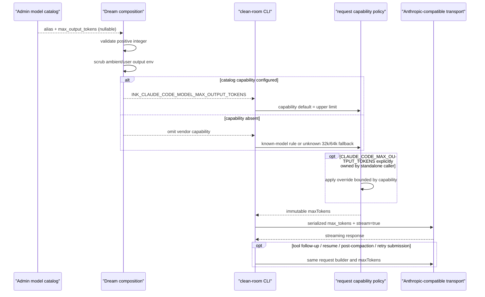

<!-- [Input] Anthropic Messages 公开协议、本地 clean-room CLI 调用图、Claude Code 2.1.88 sourcemap 的只读行为证据，以及认证模型目录的 opaque-alias capability。 -->
<!-- [Output] max_tokens 与 output_config.effort 的最小恢复设计、私有模型能力投影、时序、自审和自动化验收合同。 -->
<!-- [Pos] clean-room CLI 请求参数设计；不授权复制还原源码或在 Gateway 传输层改写请求。 -->
<!-- [Sync] 2026-08-28: 为无法按名称识别的 Gateway 模型增加 server-owned max-output capability，避免退回 unknown 32k。 -->

# Claude Messages 请求参数恢复设计

> Historical / retired implementation. Runtime 0.1.8 now builds canonical original
> src modules, identical to restored-src/src, with no parallel cleanroom implementation.
> Procedures, code paths and release/business receipts below describe the previous code,
> not current qualification. See [current alignment](claude-sourcemap-package-contract-alignment.md).

## 1. 背景与问题

当前 clean-room CLI 的 `protocol.ts` 在每次 Messages 请求处直接拼装 body。它始终保留 `stream: true`，但存在两类行为缺口：

1. `argv.ts` 把 `--effort` 当作已知有值参数消费，却没有把值写进 `RuntimeOptions`；settings 也只读取 `apiKeyHelper`，因此 effort 在请求前已经丢失，协议层又完全没有 `output_config` 投影。
2. `max_tokens` 使用 `ANTHROPIC_MAX_TOKENS` 和固定 `4096` fallback。Claude Code 2.1.88 的只读映射证据及当前公开规则均使用 `CLAUDE_CODE_MAX_OUTPUT_TOKENS`，并按模型能力选择默认值和上限；未知/兼容 Gateway 模型的默认值是 32,000，而不是把历史报文中的 32,000 硬编码成所有模型的常量。

映射仓库是非官方研究材料。实现依据限于可观察协议行为和 Anthropic 公开 API 合同，代码必须独立编写，不复制、导入或嵌入 `restored-src`。

## 2. 目标与边界

目标是在 clean-room CLI 的唯一 Messages 请求构造边界恢复两个字段，并让首轮、多轮、Tool Use 后续、resume 历史和 compaction 后的普通继续请求自然复用同一函数。保持 JSONL 状态机、SSE、provider authentication、tool dispatch 和 session persistence 不变。

本次不新增 retry 状态机：当前 Runtime 明确把 Anthropic SDK `maxRetries` 设为 `0`，不存在第二条 CLI retry 请求构造路径。若上层重新提交 turn，它仍经过同一构造器。不得借字段修复改变现有重试语义。

不修改 `/Users/dmeck/project/ink-dream-memory`、Admin、Gateway、数据库、Agent admission/lease/resume/cancel/SSE，也不修改发布 manifest、服务或生产环境。

## 3. 概念与规则

### effort

- session/env 合法值：`low`、`medium`、`high`、`xhigh`、`max`。`xhigh` 是当前协议允许值，属于对 2.1.88 四值集合的向前兼容扩展；settings 仅持久化 `low`、`medium`、`high`、`xhigh`，`max` 不持久化。
- 来源优先级：进程所有者显式投影的 `CLAUDE_CODE_EFFORT_LEVEL` > 本次 CLI `--effort` > `--settings` 的 `effortLevel`。
- `unset`/`auto`：仅环境变量可用，表示明确省略 effort；它会覆盖 CLI/settings。
- 未配置：返回 `undefined`，整个 `output_config` 在没有其他成员时省略；不得生成空字符串或默认 effort。
- 非法 CLI：在初始化期间 fail closed。非法 settings/env 按当前上游解析语义视为没有该来源，再使用下一优先级；不会把非法原文发给 API。
- 模型 capability：Opus 4.7+、Opus/Sonnet 5、Fable/Mythos 5 保留五级；Opus/Sonnet 4.6 的 `xhigh` 降为 `high`；Opus 4.5 的 `xhigh`/`max` 降为 `high`；已知不支持 effort 的模型省略字段；第一方兼容 Gateway 的未知 alias 保留显式值。未配置时仍按本任务要求省略，不复制官方 CLI 的模型默认值。
- 适用协议：本 Runtime 只有 Anthropic Messages transport。未来若加入其他 wire protocol，必须在适配器中声明 capability，不能静默复用。

### max_tokens

`max_tokens` 始终出现在 Messages body。先根据模型族得到 `{default, upperLimit}`，再应用 `CLAUDE_CODE_MAX_OUTPUT_TOKENS`：

| 模型能力族 | default | upperLimit |
| --- | ---: | ---: |
| Opus 4.7+ / Opus、Sonnet、Fable、Mythos 5 | 64,000 | 128,000 |
| Opus 4.6 | 64,000 | 128,000 |
| Sonnet 4.6 | 32,000 | 128,000 |
| Opus 4.5 / Sonnet 4.x / Haiku 4.x | 32,000 | 64,000 |
| Opus 4.0/4.1 | 32,000 | 32,000 |
| Claude 3 Opus / Haiku | 4,096 | 4,096 |
| Claude 3 Sonnet / Claude 3.5 | 8,192 | 8,192 |
| Claude 3.7 Sonnet | 32,000 | 64,000 |
| 未识别模型或兼容 Gateway 模型 | 32,000 | 64,000 |

这些是协议模型能力，不是业务配额。环境值使用上游兼容的十进制正整数解析：缺失或非法时使用模型 default，高于能力上限时裁剪到 upperLimit。不会读取旧的 `ANTHROPIC_MAX_TOKENS`，避免 ambient parent env 获得未授权控制权。

## 4. 请求构造与序列化

新增一个无状态请求策略模块，负责：解析 effort、解析模型 token capability、计算有界 max tokens、合并已有 `output_config`、构造完整 Messages body。`protocol.ts` 只在最终 `messages.create` 前调用它一次，不再自行拼这两个字段。

`output_config` 使用浅合并且仅在非空时出现；已有成员优先，effort 只填补缺失键，避免覆盖未来的 `format` 或其他输出配置。最终测试拦截本地 HTTP server 收到的 JSON，而不是只断言 helper 返回值。

## 5. 不同请求路径一致性

- 普通首轮和后续用户 turn：同一 `executeTurn` while-loop、同一 builder。
- Tool Use：工具结果追加到同一个 `requestMessages` 后，下一次循环调用同一 builder。
- resume/fork：仅在初始化时恢复 `history`，请求仍进入同一 builder。
- compaction 后继续：当前 clean-room Runtime 没有独立模型 compaction transport；恢复/替换后的 history 仍由普通 turn builder 序列化。
- retry：Anthropic SDK retry 当前关闭，没有独立 body 生成器；本修复不改变此语义。

## 6. 错误处理与 fail-closed

CLI effort 非法会在 provider 请求前终止；settings/env 的非法 effort 按上游规则忽略该来源。环境 max tokens 非法回退到模型 default，过大值裁剪；所有计算结果必须是正安全整数。

## 7. 日志脱敏

本实现不新增请求 body 日志。测试 fixture 仅在测试进程内捕获 body，并使用占位 token/正文；断言错误不得输出 Authorization、API key 或完整敏感对话。生产 JSONL、stderr、transcript 和 manifest 不记录 effort 来源、凭证或完整 HTTP body。

## 8. 兼容性与回滚

保持 `stream: true`、messages、tools、system 和 AbortSignal 不变。CLI arg/settings 只增加此前被消费但丢弃的 effort。回滚仅涉及请求策略模块及三个接入点，不要求 schema、服务重启或数据迁移。

## 9. 业务时序

```mermaid
sequenceDiagram
    participant SDK as "Claude Agent SDK"
    participant CLI as "clean-room CLI"
    participant CFG as "argv/settings/env"
    participant CAP as "model capability policy"
    participant BUILDER as "Messages request builder"
    participant LOG as "redacted diagnostics"
    participant API as "Anthropic-compatible transport"

    SDK->>CLI: start / initialize
    CLI->>CFG: parse --effort and settings
    CFG->>CFG: read CLAUDE_CODE_EFFORT_LEVEL
    alt invalid CLI effort
        CFG-->>CLI: fail closed before transport
        CLI->>LOG: stable non-sensitive error
    else invalid settings/environment effort
        CFG-->>BUILDER: ignore invalid source and continue precedence
    else env is unset/auto or effort absent
        CFG-->>BUILDER: effort = undefined
    else valid explicit effort
        CFG-->>BUILDER: low/medium/high/xhigh/max
    end
    CLI->>CAP: resolve model token default/cap
    CAP->>CAP: apply CLAUDE_CODE_MAX_OUTPUT_TOKENS
    CAP-->>BUILDER: bounded max_tokens
    SDK->>CLI: user turn / resumed history
    CLI->>BUILDER: messages + tools + system
    BUILDER->>BUILDER: merge non-empty output_config
    BUILDER->>API: JSON body with stream=true
    API-->>CLI: streaming SSE
    alt model requests tool use
        CLI->>CLI: execute tool and append tool_result
        CLI->>BUILDER: same builder for next request
        BUILDER->>API: same max_tokens/effort rules
    else next turn / resumed turn / post-compaction history
        CLI->>BUILDER: same builder
        BUILDER->>API: same serialized contract
    end
    opt transport error and external re-submit
        SDK->>CLI: retry as another normal turn
        CLI->>BUILDER: same builder; no alternate retry path
    end
    CLI->>LOG: no Authorization, API key, body, or prompt logging
```

## 10. 实现前自审

| 检查项 | 结论 |
| --- | --- |
| 是否只修改 CLI？ | 是，仅 `/Users/dmeck/project/ink-claude-code-dream`。 |
| 是否找到真实丢失点？ | 是，argv/settings 丢失 effort，protocol 缺少 output_config，max tokens 使用错误 env/default。 |
| 是否有版本证据而非按单条日志猜测？ | 是，2.1.88 映射行为、当前官方包 provider-free 拦截和公开协议交叉核验。 |
| 是否避免硬编码所有请求为 32,000？ | 是，按模型能力族计算并裁剪。 |
| effort 未配置时是否完全省略？ | 是。 |
| effort 非法是否有明确规则？ | 是，CLI fail closed；settings/env 按上游忽略非法来源。 |
| 所有请求路径是否复用同一构造器？ | 是，唯一 `messages.create` 调用点使用同一 builder。 |
| 是否保持 stream、Tool Use、resume 和 compaction 语义？ | 是；不新增 retry 状态机。 |
| 是否避免敏感日志？ | 是，不新增生产请求日志，fixture 使用占位数据。 |
| 是否修改 Dream/Admin/Gateway？ | 否。 |
| 是否增加无关抽象/数据库/任务？ | 否。 |
| 是否有独立回滚边界？ | 是。 |
| 是否可证明最终 JSON？ | 是，HTTP fixture 对最终 body 做 golden assertions。 |

全部核心约束通过，可以进入最小实现。

## 11. 自动化验收标准

测试必须覆盖五个 session effort 值、settings 可持久化集合、unset/auto/未设置/非法输入、模型 effort 降级/省略、模型 token default/cap/非法 max env、首轮/多轮/Tool Use/resume、`stream: true`、`output_config` 非覆盖合并、最终 JSON 保留字段、ambient 旧 env 不生效，以及 fixture 错误中不泄露凭证或正文。随后执行相关回归、lint、全量测试、四平台 build 与 npm package；不调用真实模型。

## 12. Opaque Gateway 模型能力补充设计

### 12.1 背景与直接原因

Runtime `0.1.2` 已恢复最新版 Claude Code 的模型族规则，但该规则只能从请求中的模型名识别 Anthropic 已知模型。认证 Gateway 目录会向 CLI 传递公开 alias；一个非 Anthropic 模型即使在目录中声明了 `max_output_tokens`，CLI 仍只能把 alias 当作 unknown model，得到 32,000 default / 64,000 upper limit。Dream 已保留完整 `GatewayModel`，但其 Runtime env 投影只包含 compact/context，丢掉了现成的 `max_output_tokens`。

这不是在模型表中增加另一项配置，也不应由 Gateway 改写请求。修复必须让选中模型的现有 capability 到达 CLI 的统一参数解析边界。

### 12.2 概念与规则

- `INK_CLAUDE_CODE_MODEL_MAX_OUTPUT_TOKENS` 是本发行版的 vendor-scoped Runtime capability，不是用户偏好，也不是 Anthropic 官方环境变量。
- 值只允许由认证模型目录的 `max_output_tokens` 投影，必须是十进制正安全整数；非法值在发起请求前 fail closed。
- capability 存在时，它同时成为 opaque alias 的 default 和 upper limit；因此目录声明的是最终 Messages `max_tokens` 的默认能力值。
- 官方 `CLAUDE_CODE_MAX_OUTPUT_TOKENS` 保留“输出覆盖”的既有语义。若同时存在，它可以把请求值调低，但不能超过模型 capability。
- capability 缺失时继续使用官方 Claude Code 的已知模型族规则；未知 alias 仍保持 32,000 / 64,000，避免为任意第三方模型猜测能力。
- Dream 必须清除 parent/user/workspace 中同名 vendor capability 和官方 output override，再投影认证模型目录值。浏览器、Deck、Plugin、workspace 与 ambient env 均不能伪造该 capability。
- 不根据 `deepseek`、`pro` 或任何具体模型 ID 分支，不硬编码目录中的业务值，也不修改 Admin 数据。

### 12.3 请求路径与兼容性

CLI 在初始化 session 时解析一次不可变的 `MessageRequestParameters`；首轮、Tool Use 续轮、resume history、compaction 后继续请求和外层重提都调用相同 `buildMessageRequest()`。新增 capability 不改变 `stream: true`、effort、messages、tools、system、SDK retry 或 SSE 处理。

Dream 的修改仅位于模型目录到 CLI env 的 composition boundary。Admin 继续拥有 `ai_models.max_output_tokens`，Gateway 继续按同一字段校验上游请求，不新增 schema、API、状态机或传输改写。

### 12.4 失败、日志与回滚

- 目录字段为 null：省略 capability，CLI 使用既有模型规则。
- 目录字段为 0、负数、非整数或超出受支持整数边界：目录解析或 CLI 初始化 fail closed，不发送请求。
- 官方 output override 非法：沿用上游规则，回退到选中模型 capability default。
- 生产日志不记录请求 body、Authorization、API key 或 prompt；测试使用本地 fixture 和占位正文。
- 回滚按 Runtime/Dream 版本合同前向发布，不修改模型数据、不覆盖已发布 npm 版本。

### 12.5 补充时序



### 12.6 补充设计自审与验收

| 检查项 | 结论 |
| --- | --- |
| 是否找到 32k 的直接原因？ | 是，目录值存在，但 Dream env 投影遗漏；CLI 因 opaque alias 使用 unknown fallback。 |
| 是否按名称硬编码第三方模型？ | 否，只消费认证目录的通用正整数 capability。 |
| 是否改变无 capability 的官方行为？ | 否，已知模型和 unknown fallback 保持不变。 |
| 是否允许 ambient/user env 伪造能力？ | 否，Dream composition 同时清除 capability 与 output override。 |
| 是否复用统一请求构造器？ | 是，最终 HTTP body 仍只有一个 builder。 |
| 是否修改 Admin/Gateway/schema/状态机/SSE？ | 否。 |
| 是否能自动化证明？ | 是，compiled HTTP fixture 断言 opaque alias 的 capability/default/bounds/invalid；Dream focused tests 断言目录投影、所有权和 parent scrub。 |

### 12.7 真实验收与发布绑定

2026-08-28 使用既有真实账户、正常 Dream/Admin/Gateway/PostgreSQL 和精确
darwin-arm64 `0.1.3` 候选完成两轮可见 Chat/resume。Admin 模型目录中的
`deepseek-v4-pro.max_output_tokens=384000` 经 Dream composition 投影后，两条 Gateway
请求均以 `max_tokens=384000`、`output_config.effort=low`、`stream=true` settled；
Authorization 保持 `[REDACTED]`，回执不包含账户、正文、数据库行或 transcript。

发布回执升级为 `ink-dream-real-business-acceptance/v2`，直接绑定真实执行的 clean-room
source-tree digest 与 native executable digest。五包 materializer 必须证明 darwin-arm64
package 中的 source/executable 与回执完全一致，正式 package 再绑定回执 digest。这样既防止
验收后二进制漂移，也避免用尚未生成的最终 tarball 反向定义验收对象。
