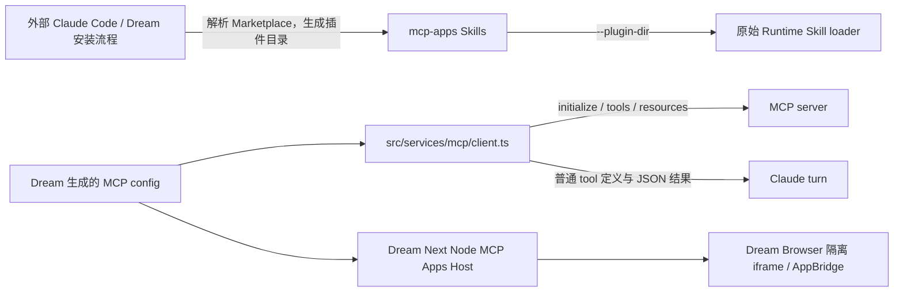
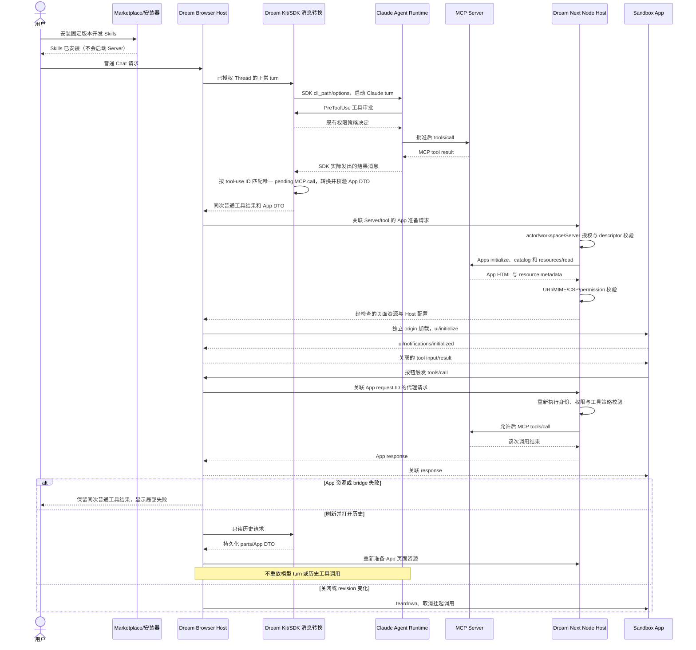

<!-- [Input] MCP Apps 2026-01-26 specification, ext-apps revision 10195ad, and original-module Runtime/Marketplace evidence. -->
<!-- [Output] Product interaction, status semantics, security boundary, compatibility matrix, and phased acceptance plan for MCP Apps. -->
<!-- [Pos] Authoritative design for the ext-apps Marketplace entry and any future MCP Apps Host capability. -->
<!-- [Sync] 2026-09-13: distinguish Runtime 0.1.9 headless MCP from Dream's existing Node/browser Host; remove superseded implementation evidence and parallel Host proposals. -->

# MCP Apps Marketplace 接入与 Host 交互方案

## 1. 背景与问题

`ink-claude-code-dream` 是无交互界面的 Claude Runtime。它已经能连接 MCP server、发现和调用 tool、列出和读取 resource，但“能读取一段 `text/html`”不等于“实现 MCP Apps 客户端协议”。MCP Apps 还要求客户端显式协商 UI 扩展、识别 tool 与 `ui://` resource 的关联、在隔离环境渲染应用，并建立 Host 与应用之间的双向 JSON-RPC 桥。

本次接入的上游 `modelcontextprotocol/ext-apps` 也必须准确分类：仓库中的 Claude Plugin Marketplace 条目 `plugins/mcp-apps` 是 4 个面向开发者的 Skills，不包含 `.mcp.json`、可启动 MCP server 或 MCP Apps Host。安装成功只证明这些 Skills 可被 Claude Code/本 Runtime 的 `--plugin-dir` 机制加载，不能证明 MCP Apps 可运行。

当前 Runtime `0.1.9` 的边界为：**支持普通 MCP，不在此 headless Runtime 内实现 MCP Apps Host**。Dream 已有独立的 Next 服务端和浏览器 Host；其 preview、权限与验收由 Dream MCP Apps 设计集定义，不能据本 Runtime 的边界判断 Dream 不支持 Apps。现有 Runtime 能保留内部 discovery/result/resource 对象中的扩展字段，并能读取 MCP App HTML 资源；但它未声明 `io.modelcontextprotocol/ui` 能力，也没有 iframe、AppBridge、权限、CSP 或 Host/UI 消息生命周期。因此保持不协商 UI 扩展是当前正确的 fail-closed 行为。

## 2. 目标与边界

### 目标

- 在仓库 Marketplace 中以官方、可验证且版本固定的方式收录 `ext-apps` 的 `mcp-apps` Skills 插件。
- 建立可重复执行的普通 MCP/MCP Apps 能力边界测试，防止把 metadata 保留或资源读取误报为完整支持。
- 给出面向 Marketplace、插件详情和未来应用容器的状态、交互、安全及恢复方案。
- 为后续 Host 实现定义最小分期、前后端合同和可验收的完成条件。

### 边界

- 本次不把上游示例伪装成 Marketplace 插件，不新增不存在的 `.mcp.json`、启动命令或 manifest。
- 本次不在这个 headless Runtime 内嵌浏览器，不实现 Dream 前端页面，不改变数据库 schema、部署或远程环境。
- 本次不把开发 Skills、普通 MCP server、MCP Apps server 和 MCP Apps Host 混为一种能力。
- 本次不主动声明 UI extension；只有安全 Host 的完整合同上线并通过验收后才允许声明。
- 上游 `examples/quickstart` 仅用作协议兼容性 fixture；它不是 Marketplace 中被安装的插件内容。

## 3. 概念与规则

### 3.1 概念

| 概念 | 本设计中的含义 |
| --- | --- |
| 普通插件 | Claude Code 可安装内容；可包含 Skills、commands、hooks、agents 或 MCP 配置，具体能力以 manifest 为准。 |
| MCP server | 通过 stdio、HTTP 或 SSE 与客户端交换 MCP initialize、tools、resources、prompts 等消息的进程或服务。 |
| MCP App | MCP tool 通过 `_meta.ui.resourceUri` 关联 `ui://` resource，由支持 Apps extension 的 Host 安全渲染并交互。 |
| MCP Apps Host | 负责扩展协商、resource 校验、sandbox、CSP、权限、AppBridge、tool result 和生命周期的客户端 UI 宿主。 |
| `mcp-apps` Skills | `ext-apps/plugins/mcp-apps` 的 4 个开发指导 Skills；不等于 server 或 Host。 |

官方规范使用 “Host” 表示承载应用 UI 的 MCP client。本项目中 Host 由 Dream 的 Next 服务端与浏览器组件提供；本仓库原 Runtime 只承担 headless MCP client 与 Claude turn，不承担浏览器 Host。

### 3.2 配置与运行状态规则

每项可配置能力都必须区分以下字段，禁止用一个 `enabled` 覆盖所有语义：

| 字段 | 定义 | 示例 |
| --- | --- | --- |
| `default` | 产品/manifest 提供的初始值，不代表用户选择或当前运行事实。 | 插件默认禁用；请求的显示模式为 inline。 |
| `desired` | 用户或管理员当前期望配置。 | 已启用；允许剪贴板写入。 |
| `effective` | 运行中的 Host 实际采用并验证过的不可变快照。 | server 已连接；UI extension 已协商；剪贴板未授权。 |
| `revision` | 配置快照的单调版本，用于判断 `desired` 与 `effective` 是否属于同一版。 | `desired.revision=8`、`effective.revision=7` 表示仍在应用中。 |

只有 fresh snapshot 同时满足以下条件，界面才能显示“可用”或“已应用”：

1. `effective.revision === desired.revision`；
2. 所有安全相关值与期望配置一致；
3. server 已连接，且 initialize 响应与客户端 UI extension 协商一致；
4. 关联 resource 通过 URI、MIME、HTML、CSP 和权限校验；
5. Host/UI 初始化和最小双向消息探测成功。

仅安装、进程启动或普通 `tools/list` 成功，分别只能显示“已安装”“启动中”或“普通 MCP 可用”。旧 revision 的成功回执不得覆盖新 desired；同 revision 异值、revision 回滚或无来源快照一律标记 invalid，并保留 last-known-good effective 供已打开应用完成安全退出。

## 4. 协议判定基线

依据 MCP Apps 规范版本 `2026-01-26`，完整客户端至少需要：

1. 通过既有配置连接 MCP server，完成 initialize 和协议版本/能力协商。
2. 在 client capabilities 中使用官方精确字段声明支持的 MIME type：

   ```json
   {
     "extensions": {
       "io.modelcontextprotocol/ui": {
         "mimeTypes": ["text/html;profile=mcp-app"]
       }
     }
   }
   ```

3. 调用 `tools/list`，保留并解释规范化的 `_meta.ui.resourceUri`、visibility 等字段；兼容期可读取已弃用的 flat key，但不得作为新写入格式。
4. 通过 `resources/read` 读取关联的 `ui://` resource，并校验 URI、精确 MIME、匹配内容以 `text` 或 base64 `blob` 提供、内容是有效 HTML5，以及 resource `_meta.ui`。
5. 在独立 origin 的双 iframe 或等价隔离容器中加载 HTML；默认拒绝网络和权限，只按声明及用户决定放行。
6. 完成 `ui/initialize` → `ui/notifications/initialized`，再传递 tool input、tool result、错误、取消和 Host context。
7. 支持应用侧受控 `tools/call`、resource 读取、消息、模型上下文更新、外链/显示模式请求；所有请求重新走 Host 授权。
8. 对关闭、重载、server 断连、revision 切换和页面崩溃提供 teardown、取消、重连与明确降级。

## 5. 当前源码与数据流

### 5.1 当前链路



- 当前 0.1.9 使用唯一原始 `src`，默认构建进入 `src/entrypoints/cli.tsx`。
- MCP client：`src/services/mcp/client.ts` 使用 SDK 的 stdio 和 Streamable HTTP transport，声明普通 roots/elicitation capabilities，不声明 `io.modelcontextprotocol/ui`。
- discovery/资源：该 client 保留 tools/resources 列表；`src/tools/ReadMcpResourceTool/ReadMcpResourceTool.ts` 使用 `resources/read` 和 ReadResourceResultSchema。原始模块 stdio/HTTP fixture 已验证普通 tool/resource 通路。
- 插件/Skills：原始 loader 经 SDK --plugin-dir 路径加载，实际 SDK fixture 已验证 local plugin/project Skill 和 hooks；Marketplace catalog 的官方开发 Skills pin 不变。
- 有意边界：现有 `runtime/core-prune-profile.json` 关闭 interactive MCP rich output，保留 headless transports/tools/resources。原始模块物理恢复不意味着新增 UI Host。
- Apps visibility/metadata/UI DTO/AppBridge 仍需独立合同与真实 Host 运行证据；旧实现的内部 metadata 测试不能被当作当前原始模块的 Apps 支持。

### 5.2 Marketplace 内容事实

仓库 `.claude-plugin/marketplace.json` 固定到上游 commit `10195ad91851502134930e9b80ec2c04e277a720` 的 `plugins/mcp-apps` 子目录。该目录的 `.claude-plugin/plugin.json` 版本为 `0.1.0`，内容为：

- `add-app-to-server`
- `convert-web-app`
- `create-mcp-app`
- `migrate-oai-app`

它没有 MCP server manifest 或运行入口。版本升级策略是人工核对新的上游 commit、manifest 和 Skills 差异后更新 SHA 与回归测试；不得跟随浮动分支自动升级。

## 6. 兼容性矩阵

本矩阵定义当前职责和必需检查；实际执行结果归入对应版本的 qualification 或 Dream MCP Apps 回执，不保留废弃实现的 registry/capabilities 测量。

| 对象 | 当前负责模块 | 校验与能力边界 |
| --- | --- | --- |
| 开发 Skills | 固定 SHA 的 Marketplace 内容及原始 plugin/Skill loader | 安装只提供 4 个开发 Skills，不启动 Server、不新增 Host |
| 普通 MCP | Runtime `src/services/mcp/client.ts` 与源码哈希绑定的构建适配 | 验证 stdio/HTTP tool/resource/permission/cancel；不协商 Apps UI extension |
| App 结果转换 | Dream Kit SDK 消息转换与 DTO 校验 | 仅适配 SDK 实际输出，匹配批准调用 ID；普通结果始终保留 |
| Apps 协商与页面资源 | Dream Next Node MCP Apps package | 按 actor/workspace/Server 授权，检查 descriptor、URI、MIME、CSP 和 permission |
| iframe/AppBridge 与交互 | Dream Browser Host | 按独立 origin 隔离，关联消息窗口和 request ID；失败降级到同次普通工具结果 |

## 7. 本次处理、影响范围与评审

复用现有 Marketplace、Runtime MCP client、Dream Kit 结果转换和 Dream Node/Browser Host。不在 Runtime 新建 Apps transport、DTO 状态机、浏览器容器或第二套权限路由。开发 Skills 固定来源和文件摘要；其更新只影响插件内容与发现，不应改变 Server 配置、笔记身份、Thread 或 transcript。

功能变更先评估插件加载、普通 MCP、SDK 结果形态、批准调用关联、Node 授权、页面隔离及历史恢复，再测试完整 Chat 新会话、tool result、App 首次加载、按钮调用、刷新历史、拒绝授权和取消。真实外部 Server/OAuth、公开应用和生产启用需要各自的业务回执，不由 provider-free fixture 推断。

设计评审以 Dream 主设计的背景/目标/概念规则和既有 default/desired/effective/revision 合同为准，不追加确认弹窗、通用插件执行框架或与本次目标无关的 Host 分期。Runtime 本身不提供 UI 时保留普通文本结果；Dream Host 的局部失败不能丢失该结果或阻断其他 Server。

## 8. 用户角色与典型场景

| 角色 | 目标 | 典型场景 |
| --- | --- | --- |
| 插件开发者 | 获得官方开发方法 | 安装 `mcp-apps` Skills，创建或迁移 MCP App；在兼容 Host 中调试。 |
| 工作区管理员 | 控制来源与权限 | 审核 Marketplace 来源、版本、server 配置、Apps 权限和 effective 状态。 |
| 最终用户 | 完成业务操作 | 在对话中调用 tool；支持时打开交互 UI，不支持时使用文本 fallback。 |
| 支持/安全人员 | 判断故障层级 | 区分安装、server、协商、resource、sandbox、bridge 和 tool call 故障。 |

## 9. Marketplace 卡片与详情页

### 9.1 卡片信息结构

卡片从上到下展示：

1. 名称 `MCP Apps Development Skills`、官方来源 `modelcontextprotocol/ext-apps`、经审查的 commit 短号。
2. 能力标签：`Claude Plugin`、`Skills ×4`；不要显示 `MCP server` 或 `MCP Apps Host`。
3. 一句话说明：“用于创建和迁移 MCP Apps；不会安装 server，也不会让当前客户端获得交互 UI。”
4. 安装状态与可用范围，例如“已安装 · 开发 Skills 可用”。
5. 主要操作：未安装为“安装”，已安装为“查看 Skills”；禁用/启用是可逆操作，不弹确认。

能力标签必须来自 manifest 静态声明与运行探测的交集：静态声明决定“可能支持”，effective 探测决定“当前可用”。缺失声明不可从名称猜测。

### 9.2 详情页

详情页包含来源、固定 revision、上次审核日期、安装内容清单、运行要求（Node.js 只适用于上游 SDK/示例，不应用于 4 个纯 Markdown Skills）、能力与缺口、权限、诊断以及卸载入口。将“开发 Skills 状态”和“当前客户端 MCP Apps Host 状态”分成两个信息组，避免视觉上合并。

## 10. 状态模型与状态来源

| 用户态 | 判定 | 主要来源 | 可用操作 |
| --- | --- | --- | --- |
| 安装前 | catalog 有条目，本地无 installation receipt | Marketplace + 安装器 | 安装、查看来源 |
| 安装中 | 安装 job active | 安装器 job | 取消 |
| 已安装 | manifest 与文件摘要通过，本地存在 | installation receipt | 启用、卸载、查看 Skills |
| 启动中 | server desired=enabled，连接/协商尚未完成 | MCP registry | 取消、诊断 |
| 普通 MCP 可用 | server connected，普通 tool/resource 探测通过 | Runtime snapshot | 使用文本能力 |
| MCP Apps 可用 | desired/effective/revision 匹配且 Host 五项门禁通过 | Host capability snapshot | 打开应用 |
| 部分可用 | 普通 MCP 可用但 Apps 门禁缺失；或部分 tool 无 UI | capability matrix | 使用 fallback、查看缺口 |
| 不兼容 | manifest/协议/MIME/安全要求确定不满足 | validator | 查看要求、切换兼容 Host |
| 运行失败 | 曾可尝试但启动、网络、授权、resource 或 bridge 失败 | 分层 error receipt | 重试、重新授权、诊断 |
| 已禁用 | desired=disabled，effective 已停止 | revisioned snapshot | 启用、卸载 |

前三种安装状态属于 installation 轴，server 启动/普通 MCP/授权/运行失败属于 server 轴，Apps checking/ready/partial/incompatible/failed 属于 Apps 轴；同一页面可以同时展示“Skills 已安装”“普通 MCP 可用”“Apps 不兼容”。Apps 轴优先级为：确定违反协议或安全要求时 `incompatible`；门禁检查仍在进行时 `checking`；门禁部分通过且仍有可恢复缺口时 `partial`；运行中断为 `failed`；全部门禁通过才是 `apps_ready`。

状态必须包含 `reasonCode`、`observedAt` 和来源，但卡片只显示帮助决策的摘要；技术详情放在“诊断”。“连接成功”只对应 transport/server，不得替代 Apps 状态。

## 11. 安装、启用与首次打开

### 11.1 安装与启用

1. 用户在卡片选择“安装”。安装器校验 catalog schema、固定来源、plugin manifest 和目标目录，不弹可逆操作确认。
2. 安装成功后展示“开发 Skills 已安装”，列出 4 个 Skills；不启动任何 server。
3. 若另一个插件或用户配置提供 MCP server，启用流程创建新的 desired revision；Runtime 连接并回传 effective 普通 MCP 状态。
4. 若 server 提供 MCP App，但 Host 不支持，详情显示“普通 MCP 可用 · 交互 UI 不受支持”，仍允许文本 fallback。

### 11.2 首次打开与运行中交互



首次打开只在应用实际请求敏感权限时提示。Host 在加载前展示应用名称、server 来源和即将授予的权限；没有权限请求时直接打开。运行中将应用与产生它的 tool call、server 和 revision 绑定，禁止跨 server 借用身份。

## 12. UI resource 承载与安全边界

- 资源必须是关联 tool 指定的 `ui://` URI，通过同一 MCP server 的 `resources/read` 获取；禁止从任意外部 URL直接当作 App HTML。
- 仅接受规范声明的 MCP App MIME；HTML text/blob 先做结构和大小政策校验。大小、超时和域名均来自 policy/config，不写死在产品逻辑或文案中。
- Host 页面不直接执行 server HTML。建议 outer Host iframe + 不同 origin sandbox proxy + inner app iframe；sandbox token、Permissions Policy 和 CSP 取声明与产品 policy 的最小交集。
- 默认禁止网络、导航、弹窗、下载、摄像头、麦克风、地理位置、剪贴板等能力。权限按应用、server、来源 revision 和会话记录，变更 revision 后重新评估。
- `postMessage` 必须校验 origin、窗口身份、JSON-RPC schema、request id 和允许的方法；应用侧请求不得绕过现有 MCP permission/admission 顺序。
- 外链由 Host 打开并显示目标来源；应用不能直接顶层导航。敏感 tool result 和凭证不得写入 telemetry、URL 或通用错误文案。
- 不安全路径应 fail closed：不声明 Apps capability、不渲染 HTML、保留普通文本 fallback，不影响既有 MCP 会话。

## 13. 权限、错误、恢复与卸载

### 13.1 权限请求

提示包含“请求方、所需能力、作用范围、持续时间”，操作为“允许一次”“本次会话允许”“拒绝”。只有不可逆或明显高风险的 tool 继续使用现有确认流程；普通打开、关闭、禁用和重试不增加确认弹窗。

### 13.2 错误分层

| 层级 | 用户文案原则 | 恢复动作 |
| --- | --- | --- |
| 安装 | “插件文件未完成校验” | 重试安装、查看来源 |
| server | “MCP server 未启动/需要授权” | 重连、授权、查看日志 |
| 协商 | “当前客户端未启用交互界面协议” | 使用文本结果、兼容 Host |
| resource | “应用界面资源无效或不可读取” | 重读资源、报告 server |
| 安全 | “应用请求的来源或权限未获允许” | 调整管理员 policy 或拒绝 |
| bridge | “交互界面未完成初始化” | 重新加载应用；取消挂起请求 |
| tool | 展示 server 返回的安全摘要 | 重试、修改输入、查看诊断 |

自动重试只用于确定幂等的连接/resource 读取，并遵循配置策略；tool call 不做隐式重放。恢复时生成新 runtime attempt，但 desired revision 不因瞬时失败变化。已打开应用在 server 断连后进入只读/失效态，禁止继续发起 tool call；重连并重新协商后创建新的 effective snapshot。

### 13.3 禁用与卸载

禁用是可逆操作：停止新调用、取消未完成请求、teardown iframe、关闭连接，再回写 effective disabled，无确认弹窗。卸载会删除安装内容，若没有用户数据或不可逆影响可直接执行并提供短时“撤销”；有未保存应用状态时先说明会丢失的具体内容，而不是使用通用确认。

## 14. 空、加载、异常状态与无障碍

- 空状态：“尚未安装开发 Skills”或“当前 server 没有关联的交互界面”，两者不可合并。
- 加载状态分“安装内容”“启动 server”“验证交互界面”“加载应用”，并给出可取消操作；不循环显示模糊“连接中”。
- 异常状态保留文本/structured result，提供“重试界面”“查看诊断”“在兼容 Host 打开”等可行动入口。
- 状态和能力标签不能只靠颜色；使用图标、文本和 `aria-live`。焦点先进入应用标题/状态区，再进入 iframe；关闭后返回触发按钮。
- `Tab` 不应困在 iframe；提供 Host 级“离开应用”和“关闭应用”快捷方式，`Esc` 仅退出 fullscreen/overlay，不取消业务 tool。
- 权限对话框可全键盘操作，默认焦点放在最小授权或拒绝选项；屏幕阅读器读出请求方和范围。

## 15. 关键文案

| 场景 | 推荐文案 |
| --- | --- |
| Marketplace 卡片 | “官方 MCP Apps 开发 Skills；不包含 server 或交互界面 Host。” |
| Skills 安装完成 | “4 个开发 Skills 已安装。当前客户端的 MCP Apps 支持状态未改变。” |
| 普通 MCP 可用 | “工具可用；此客户端暂不能显示该工具的交互界面。” |
| 协商完成 | “交互界面协议已验证，可以打开。” |
| revision 未应用 | “正在应用最新配置；当前运行版本为上一版。” |
| 安全拒绝 | “该界面请求的来源或权限不在允许范围内，已改用文本结果。” |
| bridge 失败 | “交互界面未完成初始化。工具结果仍可在对话中查看。” |

避免使用孤立的“连接成功”“插件可用”“已应用”等无法说明能力层级的文案。

## 16. 前后端状态模型

Skills 安装、MCP server 和 MCP Apps Host 是三条可并存的状态轴。Marketplace 页面可以合并展示三个快照，但不得把它们压成一个枚举，也不得要求 skills-only 插件具有 `serverId`。建议的只读状态快照如下；字段名表示语义，不规定具体传输框架：

```ts
interface PluginInstallationSnapshot {
  pluginId: string;
  default: PluginDesiredConfig;
  desired: PluginDesiredConfig & { revision: number };
  effective?: PluginEffectiveConfig & { revision: number; observedAt: string };
  installationState: "not_installed" | "installing" | "installed" | "failed";
  activationState: "enabled" | "disabled";
  observedAt: string;
  evidenceSource: "installer";
  reasonCode?: string;
}

interface McpServerSnapshot {
  serverId: string;
  default: McpServerDesiredConfig;
  desired: McpServerDesiredConfig & { revision: number };
  effective?: McpServerEffectiveConfig & { revision: number; observedAt: string };
  serverState: "disabled" | "starting" | "mcp_ready" | "needs_auth" | "failed";
  observedAt: string;
  evidenceSource: "runtime";
  reasonCode?: string;
}

interface McpAppHostSnapshot {
  serverId: string;
  appResourceUri: string;
  default: McpAppDesiredConfig;
  desired: McpAppDesiredConfig & { revision: number };
  effective?: McpAppEffectiveConfig & { revision: number; observedAt: string };
  appsState: "checking" | "apps_ready" | "partial" | "incompatible" | "failed" | "disabled";
  observedAt: string;
  evidenceSource: "apps_host";
  gates: {
    extensionNegotiation: Gate;
    toolMetadata: Gate;
    resource: Gate;
    secureHost: Gate;
    bridge: Gate;
  };
  reasonCode?: string;
}
```

安装快照由安装器签发；server 与 Host 快照由运行服务端签发，各自拥有 revision，页面只做关联展示。后端只发送经过 schema 校验和最小化的 metadata/resource/result，不发送任意 registry 对象。前端不从“有 `_meta`”自行推断支持；只根据后端签发的 revisioned gates 展示 Apps 入口。effective snapshot 必须 server-owned、immutable，不能在 turn 主路径临时查询或变更 policy。

## 17. 诊断与埋点

诊断事件建议覆盖：catalog 校验、安装摘要、server connect、协议版本、extension negotiation、tool/resource id、MIME validation、sandbox load、bridge initialize、应用侧方法、权限决定、取消、teardown 和 reasonCode。事件关联 installation id、server id、session id、tool call id 与 revision，但不得记录正文、HTML、tool result、凭证或完整外部 URL。

产品指标只用于定位漏斗和可靠性：安装成功率、普通 MCP ready、Apps gates 通过率、首开时延、权限拒绝率、bridge 失败率、文本 fallback 使用率。禁止把未协商的 server connect 计入 Apps 成功率。

## 18. 验收标准

### 本次接入

- Marketplace schema 被官方 Claude Code validator 接受。
- 隔离配置下能 add/list/install `mcp-apps@ink-claude-code-dream`，安装物与固定 commit 的上游 `plugins/mcp-apps` 相同。
- Runtime 能从安装目录加载 4 个 Skills。
- provider-free 回归确认普通 MCP tool/result/resource 可用、Apps metadata 在 registry 内保留、model projection 不宣称 UI、initialize 未声明 UI extension。
- 卡片和文档明确“Skills 可用、Host 不支持”，不会用安装结果推导 Apps 可用。

### 未来完整 Host

- 客户端只在 Host 安全门禁已就绪时声明 `io.modelcontextprotocol/ui` 与实际支持 MIME。
- 对固定 quickstart 和产品 server，完成 tool → resource → sandbox → `ui/initialize`/`ui/notifications/initialized` → 双向 tool/resource 调用 → result/cancel → teardown 的真实 E2E。
- app-only tool 不暴露给模型；应用侧调用必须沿用既有权限、server 和 session 边界。
- CSP、origin、Permissions Policy、外链、恶意 postMessage、无效 MIME/HTML、断连和 revision 回滚均 fail closed，并保留文本 fallback。
- Apps 故障不改变已有普通 MCP、Claude session、resume/cancel 或其他插件行为。
- 保存脱敏协议日志和 UI 截图，明确区分自动化与真实运行证据。

## 19. 暂不支持范围

- 当前 Runtime 中的 MCP Apps UI 渲染、AppBridge 和双向消息。
- fullscreen、picture-in-picture、多窗口、持久化应用状态及后台应用。
- 浮动上游版本自动更新、未审查的第三方 HTML 或外部 URL 直接渲染。
- 以 Marketplace 插件安装自动创建/启动 quickstart server。
- 因本次能力新增数据库表、DDL、部署通道或远程环境差异路径。

## 20. 一手资料与检查基线

- [MCP Apps Overview](https://modelcontextprotocol.io/extensions/apps/overview)，检查日期 2026-09-02。
- [MCP Apps Extension specification 2026-01-26（固定 commit）](https://github.com/modelcontextprotocol/ext-apps/blob/10195ad91851502134930e9b80ec2c04e277a720/specification/2026-01-26/apps.mdx)，检查日期 2026-09-02。
- [`modelcontextprotocol/ext-apps`](https://github.com/modelcontextprotocol/ext-apps)，检查 commit `10195ad91851502134930e9b80ec2c04e277a720`，package version `1.7.5`，检查日期 2026-09-02。
- [上游 Marketplace manifest（固定 commit）](https://github.com/modelcontextprotocol/ext-apps/blob/10195ad91851502134930e9b80ec2c04e277a720/.claude-plugin/marketplace.json) 与 [`mcp-apps` plugin manifest（固定 commit）](https://github.com/modelcontextprotocol/ext-apps/blob/10195ad91851502134930e9b80ec2c04e277a720/plugins/mcp-apps/.claude-plugin/plugin.json)，检查日期 2026-09-02。
- [Quickstart server（固定 commit）](https://github.com/modelcontextprotocol/ext-apps/blob/10195ad91851502134930e9b80ec2c04e277a720/examples/quickstart/server.ts) 与 [basic-host AppBridge 实现（固定 commit）](https://github.com/modelcontextprotocol/ext-apps/blob/10195ad91851502134930e9b80ec2c04e277a720/examples/basic-host/src/implementation.ts)，检查日期 2026-09-02。
- [Claude Code plugin marketplaces](https://code.claude.com/docs/en/plugin-marketplaces) 与 [Plugins reference](https://code.claude.com/docs/en/plugins-reference)，检查日期 2026-09-02。
- [Claude MCP Apps getting started](https://claude.com/docs/connectors/building/mcp-apps/getting-started)，检查日期 2026-09-02。

上游 README 明确把根 package 分为 app SDK、React hooks 与 AppBridge，并说明仓库除 `examples/basic-host` 外不提供受支持 Host；quickstart 则是独立 server/app 示例。根 SDK package 与示例要求 Node.js `>=20`；4 个 Markdown Skills 本身不生成 MCP 配置、启动参数或 Node 运行时要求。以上内容与本地固定 commit 的 manifest、package 和示例源码做了交叉核对。
